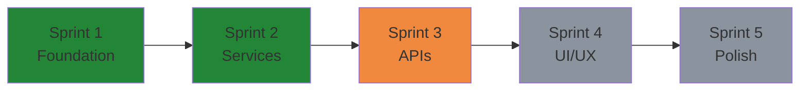
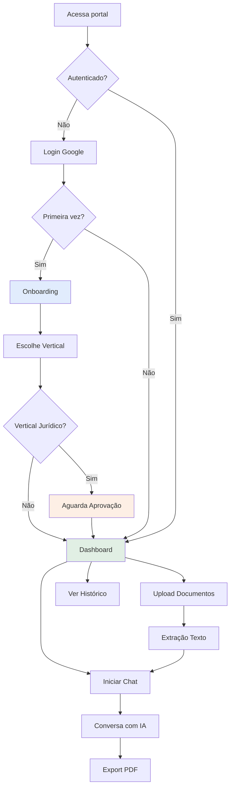

# 🎯 Visão Geral do Projeto

## O Que É a Plataforma Sunyata

A **Plataforma Sunyata** é um sistema web de **ensino e consultoria em IA Generativa** que permite usuários interagirem com documentos através de conversas com IA (Claude AI).

### 🎯 Objetivo Principal

Criar um **MVP Canvas** que permita:
- Upload de documentos (PDF, DOCX)
- Conversas contextualizadas com IA sobre os documentos
- Export de conversas para PDF
- Gestão de múltiplas "verticais" (áreas de atuação)

### 👥 Público-Alvo

**Usuários finais:**
- Professores (vertical Docência)
- Pesquisadores (vertical Pesquisa)
- Profissionais jurídicos (vertical Jurídico)
- PMOs e gestores (vertical Diagnext)
- Estudantes IFRJ (vertical IFRJ Alunos)

**Equipe técnica:**
- Filipe Litaiff (Product Owner)
- Claude Code (Desenvolvimento)
- Manus AI (Code Review & Arquitetura)
- Futura equipe de desenvolvedores

---

## 🎨 Filosofia do Projeto

### MVP-First

Este projeto segue a filosofia **MVP-first**:

> **Validação antes de fundação técnica**

**Isso significa:**
- ✅ Focar nos 20% de features que entregam 80% do valor
- ✅ Pragmatismo sobre perfeição técnica
- ✅ Soluções simples que funcionam
- ❌ Evitar overengineering (Event Sourcing, CQRS, microserviços, etc.)

**MAS sem comprometer:**
- 🔒 **Segurança** - Sempre rigorosa (ownership checks, CSRF, sanitização)
- 📊 **Qualidade** - Code reviews sistemáticos
- 📖 **Documentação** - Decisões rastreáveis

### Desenvolvimento Iterativo

**Sprints curtos e focados:**


Cada sprint:
- **Dura ~1-2 semanas**
- **Tem objetivos claros** (3-5 features)
- **Termina com deploy** em produção
- **Inclui code review** do Manus
- **Gera documentação**

---

## 🏛️ Contexto e Requisitos

### Requisitos Funcionais

**RF-01: Autenticação Google**
- Login via Google OAuth
- Gestão de sessão PHP
- Logout seguro

**RF-02: Onboarding Multi-Vertical**
- Usuário escolhe vertical de atuação
- Fluxo específico por vertical
- Aprovação do Jurídico (quando aplicável)

**RF-03: Upload de Documentos**
- Suporte PDF e DOCX
- Validação MIME type
- Extração de texto automática
- Armazenamento seguro

**RF-04: Chat com IA**
- Conversas contextualizadas
- Uso de documentos como contexto
- Streaming de respostas
- Histórico de mensagens

**RF-05: Export de Conversas**
- Geração de PDF formatado
- Inclusão de metadados
- Download seguro

**RF-06: Dashboard**
- Visualização de conversas
- Gestão de arquivos
- Estatísticas básicas

### Requisitos Não-Funcionais

**RNF-01: Segurança**
- Ownership checks em todas operações
- CSRF protection
- Rate limiting (10 uploads/hora)
- Input sanitization

**RNF-02: Performance**
- Tempo de resposta < 2s (exceto IA)
- Upload de arquivos até 10MB
- Suporte a 100 usuários simultâneos

**RNF-03: Compatibilidade**
- Navegadores modernos (Chrome, Firefox, Safari)
- Mobile responsive
- Hospedagem compartilhada (Hostinger)

**RNF-04: Manutenibilidade**
- Código documentado
- Arquitetura em camadas
- Testes de bug fixes
- Versionamento Git

---

## 🌍 Ambientes

### Desenvolvimento (Local)

**Localização:** WSL Ubuntu (local do desenvolvedor)
```
Path: /home/iflitaiff/projetos/plataforma-sunyata
Servidor: Apache (ou PHP built-in)
Banco: MariaDB local
```

**Características:**
- Debug mode ativo
- Logs verbose
- Hot reload

### Produção (Hostinger)

**Localização:** Shared Hosting Hostinger
```
Host: 82.25.72.226 (porta SSH 65002)
Path: /home/u202164171/domains/sunyataconsulting.com/public_html/plataforma-sunyata
URL: https://portal.sunyataconsulting.com
Banco: MariaDB via phpMyAdmin
```

**Características:**
- Error reporting desabilitado
- Logs em arquivo
- HTTPS obrigatório
- Cache habilitado

**Deployment:** Via SSH + SCP (manual)

---

## 📊 Modelo de Negócio

### Verticais Disponíveis

| Vertical | Descrição | Status |
|----------|-----------|--------|
| **Docência** | Ensino de IA para professores | <span class="badge badge-done">Ativo</span> |
| **Pesquisa** | Suporte a pesquisadores | <span class="badge badge-done">Ativo</span> |
| **Jurídico** | Análise de documentos legais | <span class="badge badge-done">Ativo</span> |
| **Diagnext** | PMO e gestão de projetos | <span class="badge badge-done">Ativo</span> |
| **IFRJ Alunos** | Estudantes do IFRJ | <span class="badge badge-done">Ativo</span> |

### Fluxo do Usuário



---

## 🎯 Objetivos por Sprint

### Sprint 1: Foundation ✅
**Objetivo:** Estrutura base funcional

**Entregas:**
- Setup do projeto (Composer, autoload)
- Autenticação Google OAuth
- Sistema de onboarding
- Verticais básicas
- Dashboard inicial

**Resultado:** Base sólida para desenvolvimento

### Sprint 2: Services Layer ✅
**Objetivo:** Lógica de negócio reutilizável

**Entregas:**
- FileUploadService (upload + validação)
- DocumentProcessorService (extração texto)
- ConversationService (CRUD conversas)
- Bug fixes de segurança (9 bugs)

**Resultado:** Camada de serviços production-ready

### Sprint 3: APIs 🔄
**Objetivo:** Endpoints RESTful JSON

**Entregas planejadas:**
- /api/upload-file.php
- /api/chat.php
- /api/export-conversation.php

**Status:** Em progresso (aguardando aprovação)

---

## 🔗 Links Importantes

**Produção:**
- 🌐 Portal: https://portal.sunyataconsulting.com
- 📋 COMM-BOARD: https://portal.sunyataconsulting.com/COMM-BOARD.html

**Desenvolvimento:**
- 💻 GitHub: https://github.com/iflitaiff/plataforma-sunyata
- 📖 Documentação: https://portal.sunyataconsulting.com/docs/

**Equipe:**
- 👤 Filipe Litaiff: flitaiff@gmail.com
- 🤖 Claude Code: claude.com/claude-code
- 🧠 Manus AI: (via COMM-BOARD)

---

## 📝 Convenções e Padrões

### Nomenclatura

**PHP Classes:**
```php
// PascalCase + Singular
FileUploadService
DocumentProcessorService
ConversationService
```

**Database Tables:**
```sql
-- snake_case + plural
users
user_files
conversations
conversation_messages
```

**PHP Methods:**
```php
// camelCase + verbo
uploadFile()
extractText()
createConversation()
```

**API Endpoints:**
```
// kebab-case
/api/upload-file.php
/api/chat.php
/api/export-conversation.php
```

### Padrões Arquiteturais

**Singleton nos Services:**
```php
class FileUploadService {
    private static ?self $instance = null;

    public static function getInstance(): self {
        if (self::$instance === null) {
            self::$instance = new self();
        }
        return self::$instance;
    }
}
```

**Prepared Statements sempre:**
```php
// ✅ CORRETO
$stmt = $this->db->prepare("SELECT * FROM users WHERE id = :id");
$stmt->execute(['id' => $userId]);

// ❌ ERRADO (SQL injection!)
$query = "SELECT * FROM users WHERE id = {$userId}";
```

**Ownership checks obrigatórios:**
```php
// ✅ CORRETO
$file = $this->db->fetchOne(
    "SELECT * FROM user_files WHERE id = :id AND user_id = :user_id",
    ['id' => $fileId, 'user_id' => $userId]
);

// ❌ ERRADO (quebra de acesso!)
$file = $this->db->fetchOne(
    "SELECT * FROM user_files WHERE id = :id",
    ['id' => $fileId]
);
```

---

<div style="text-align: center; margin: 40px 0; padding: 20px; background: #1f6feb22; border-radius: 8px;">
  <p style="font-size: 16px; margin: 0;">
    Próximo: <a href="02-arquitetura.md">🏗️ Arquitetura →</a>
  </p>
</div>
