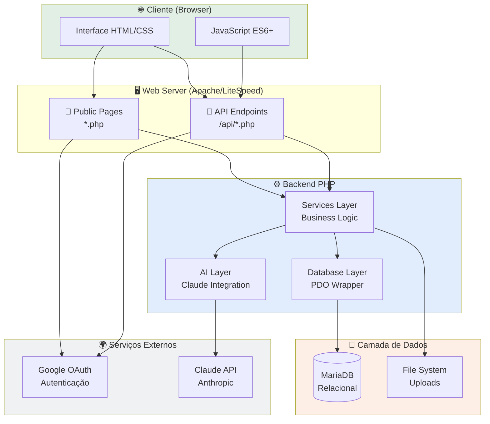
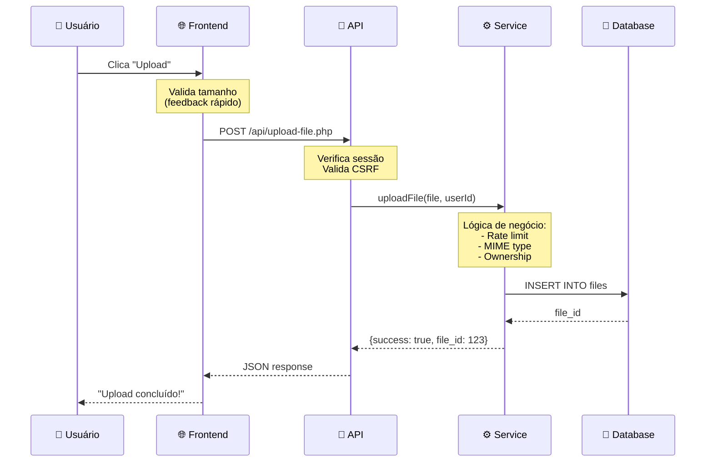
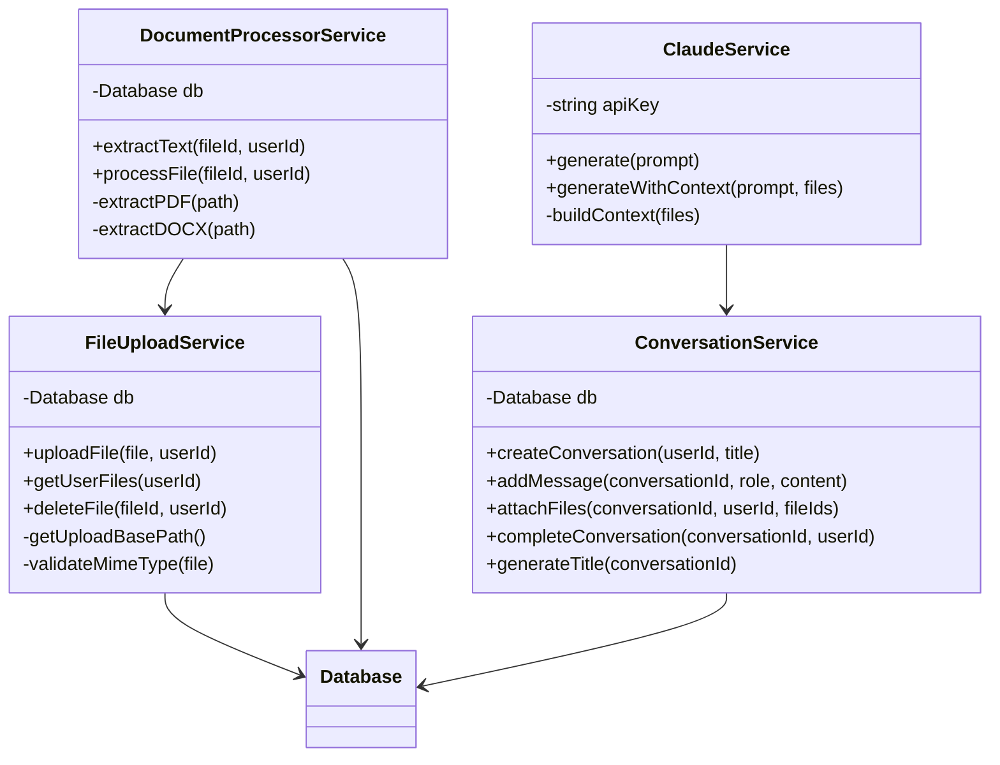
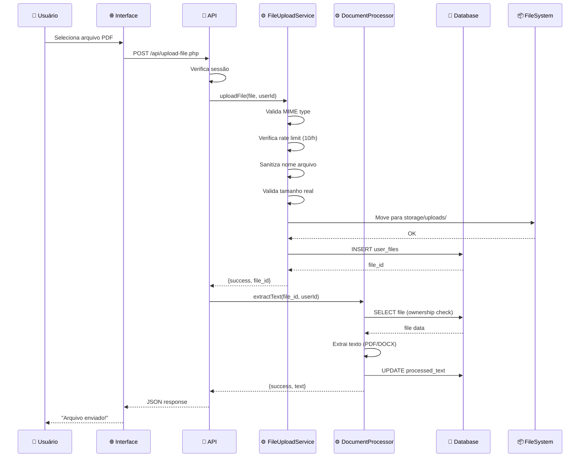
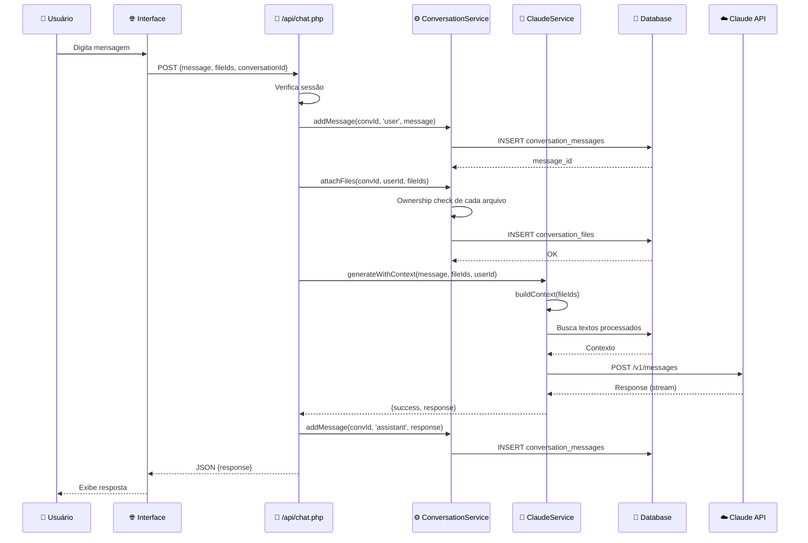

# 🏗️ Arquitetura do Sistema

## Visão Geral

A Plataforma Sunyata organiza o sistema em **camadas** (layers), onde cada camada tem uma responsabilidade específica e se comunica com as outras de forma controlada. Esta separação permite manutenibilidade, testabilidade e reutilização de código.

([ver explicação didática](apendice-iniciantes.md#arquitetura-em-camadas))

### Nossa Arquitetura

A Plataforma Sunyata segue uma **arquitetura em camadas** (layered architecture) com 6 camadas principais:

1. 🌐 **Presentation** - Interface do usuário (HTML/CSS/JS)
2. 📄 **Public Pages** - Páginas PHP com lógica mínima
3. 🔌 **API** - Endpoints RESTful JSON
4. ⚙️ **Services** - Lógica de negócio reutilizável
5. 🤖 **AI** - Integração com Claude API
6. 💾 **Database** - Acesso aos dados

### Diagrama de Alto Nível



---

## 🔄 Como as Camadas Conversam?

### Regra de Ouro: Comunicação Unidirecional

A comunicação entre camadas flui em uma única direção: Frontend → API → Services → Database. Camadas inferiores nunca comunicam diretamente com camadas superiores.

([ver explicação didática](apendice-iniciantes.md#comunicação-entre-camadas))

### Fluxo Permitido ✅

```
Frontend → API → Services → Database
   ↓        ↓        ↓
  HTML    JSON    SQL
```

### Fluxo Proibido ❌

```
Database → Frontend  ❌ NÃO!
Services → Frontend  ❌ NÃO!
```

**Por quê?**
- ✅ **Manutenibilidade** - Mudanças em uma camada não quebram outras
- ✅ **Testabilidade** - Posso testar Services sem Frontend
- ✅ **Reutilização** - Mesmos Services para Web + Mobile + CLI

### Exemplo Prático: Upload de Arquivo



**Observe:**
1. Cada camada faz **apenas** sua responsabilidade
2. Frontend não acessa Database diretamente
3. Database não "sabe" que existe um Frontend
4. Service pode ser reutilizado por outra API (mobile, CLI)

---

## Camadas da Aplicação

### 1. 🌐 Presentation Layer (Frontend)

**Responsabilidade:** Interface do usuário

**Tecnologias:**
- HTML5 semântico
- Bootstrap 5.3.2 (UI Framework)
- Vanilla JavaScript (ES6+)
- Fetch API para AJAX

**Arquivos principais:**
```
public/
├── dashboard.php           # Dashboard principal
├── onboarding-step2.php   # Onboarding
├── areas/*/index.php      # Verticais
└── assets/
    ├── css/style.css
    └── js/app.js
```

**Exemplo de comunicação com API:**
```javascript
// public/assets/js/app.js
async function uploadFile(file) {
    const formData = new FormData();
    formData.append('file', file);

    const response = await fetch('/api/upload-file.php', {
        method: 'POST',
        body: formData
    });

    const result = await response.json();
    return result;
}
```

([ver explicação didática](apendice-iniciantes.md#presentation-layer))

---

### 2. 📄 Public Pages Layer

**Responsabilidade:** Páginas web com lógica mínima

**Padrão:**
```php
<?php
// 1. Setup
require_once __DIR__ . '/../config/config.php';
session_start();

// 2. Autenticação
if (!isset($_SESSION['user_id'])) {
    header('Location: /login.php');
    exit;
}

// 3. Lógica de apresentação (mínima)
$userId = $_SESSION['user_id'];
$files = FileUploadService::getInstance()->getUserFiles($userId);

// 4. Render HTML
?>
<!DOCTYPE html>
<html>
...
</html>
```

**Características:**
- ✅ **Verificação de sessão** - Garante que apenas usuários autenticados acessem a página, redirecionando para login se necessário
- ✅ **Chamadas a Services** - Delega toda lógica de negócio para a camada de Services, mantendo a página focada apenas em apresentação
- ✅ **Render de HTML** - Responsável por gerar a interface visual (HTML/CSS/JS) que o usuário vê no navegador
- ❌ **NÃO contém lógica de negócio** - Validações, cálculos e regras de negócio ficam nos Services, não nas páginas
- ❌ **NÃO acessa banco diretamente** - Todo acesso a dados passa obrigatoriamente pela camada de Services

([ver explicação didática](apendice-iniciantes.md#public-pages-layer))

---

### 3. 🔌 API Layer

**Responsabilidade:** Endpoints RESTful JSON

**Estrutura:**
```
public/api/
├── upload-file.php         # POST - Upload de arquivo
├── chat.php                # POST - Enviar mensagem
└── export-conversation.php # GET  - Export para PDF
```

**Padrão de Endpoint:**
```php
<?php
// api/upload-file.php

require_once __DIR__ . '/../../config/config.php';
session_start();

header('Content-Type: application/json');

try {
    // 1. Validação de autenticação
    if (!isset($_SESSION['user_id'])) {
        http_response_code(401);
        echo json_encode(['error' => 'Não autenticado']);
        exit;
    }

    // 2. Validação de método HTTP
    if ($_SERVER['REQUEST_METHOD'] !== 'POST') {
        http_response_code(405);
        echo json_encode(['error' => 'Método não permitido']);
        exit;
    }

    // 3. Validação de input
    if (!isset($_FILES['file'])) {
        http_response_code(400);
        echo json_encode(['error' => 'Arquivo não enviado']);
        exit;
    }

    // 4. Chamada ao Service
    $fileService = FileUploadService::getInstance();
    $result = $fileService->uploadFile($_FILES['file'], $_SESSION['user_id']);

    // 5. Response
    if ($result['success']) {
        http_response_code(200);
        echo json_encode($result);
    } else {
        http_response_code(400);
        echo json_encode($result);
    }

} catch (Exception $e) {
    error_log('API Error: ' . $e->getMessage());
    http_response_code(500);
    echo json_encode(['error' => 'Erro interno do servidor']);
}
```

**Características:**
- ✅ **Content-Type: application/json** - Todas as respostas são em formato JSON, facilitando integração com frontends modernos (React, Vue, etc)
- ✅ **HTTP status codes corretos** - Usa códigos semânticos (200 OK, 400 Bad Request, 401 Unauthorized, 500 Internal Error) para indicar resultado
- ✅ **Tratamento de exceções** - Captura erros inesperados com try-catch e retorna mensagens amigáveis ao invés de expor detalhes internos
- ✅ **Logging de erros** - Registra erros em logs para debugging, permitindo rastrear problemas em produção sem expor ao usuário
- ❌ **NÃO contém lógica de negócio** - APIs são apenas pontos de entrada; toda lógica fica nos Services
- ❌ **NÃO acessa banco diretamente** - Mantém separação de responsabilidades delegando acesso a dados para Services

([ver explicação didática](apendice-iniciantes.md#api-layer))

---

### 4. ⚙️ Services Layer

**Responsabilidade:** Lógica de negócio reutilizável

**Services disponíveis:**



**Padrão de Service (Singleton):**
```php
<?php
namespace App\Services;

use App\Database\Database;

class FileUploadService
{
    private static ?self $instance = null;
    private Database $db;

    private const MAX_FILE_SIZE = 10 * 1024 * 1024; // 10MB
    private const ALLOWED_TYPES = ['application/pdf', 'application/vnd.openxmlformats-officedocument.wordprocessingml.document'];

    private function __construct()
    {
        $this->db = Database::getInstance();
    }

    public static function getInstance(): self
    {
        if (self::$instance === null) {
            self::$instance = new self();
        }
        return self::$instance;
    }

    public function uploadFile(array $fileData, int $userId): array
    {
        // Lógica de negócio...
    }
}
```

**Características:**
- ✅ **Singleton pattern** - Garante uma única instância de cada Service, evitando múltiplas conexões ao banco e centralizando estado
- ✅ **Type hints (PHP 8.2)** - Declara tipos de parâmetros e retornos (int, array, string), detectando erros em tempo de desenvolvimento
- ✅ **Namespaces PSR-4** - Organiza código em namespaces (App\Services) seguindo padrão PSR-4, permitindo autoload automático
- ✅ **Dependency injection (Database)** - Recebe dependências via construtor ao invés de criar internamente, facilitando testes e manutenção
- ✅ **Ownership checks** - Verifica se usuário tem permissão para acessar recurso (ex: só pode deletar seus próprios arquivos)
- ✅ **Error handling com try-catch** - Captura exceções e retorna arrays estruturados {success, message}, evitando crashes
- ✅ **Logging contextual** - Registra operações importantes com contexto (userId, fileId) para auditoria e debugging

([ver explicação didática](apendice-iniciantes.md#services-layer))

---

### 5. 🤖 AI Layer

**Responsabilidade:** Integração com Claude API

**ClaudeService:**
```php
<?php
namespace App\AI;

class ClaudeService
{
    private string $apiKey;
    private string $model = 'claude-3-5-sonnet-20241022';

    public function __construct()
    {
        $this->apiKey = $_ENV['ANTHROPIC_API_KEY'];
    }

    /**
     * Gera resposta com contexto de arquivos
     */
    public function generateWithContext(string $userMessage, array $fileIds, int $userId): array
    {
        try {
            // 1. Buscar arquivos e extrair contexto
            $context = $this->buildContext($fileIds, $userId);

            // 2. Construir prompt
            $systemPrompt = "Você é um assistente especializado. Use o contexto abaixo:\n\n";
            $systemPrompt .= $context;

            // 3. Chamar API
            $response = $this->callAPI([
                'model' => $this->model,
                'max_tokens' => 4096,
                'system' => $systemPrompt,
                'messages' => [
                    ['role' => 'user', 'content' => $userMessage]
                ]
            ]);

            return [
                'success' => true,
                'response' => $response['content'][0]['text']
            ];

        } catch (Exception $e) {
            error_log('ClaudeService error: ' . $e->getMessage());
            return [
                'success' => false,
                'message' => 'Erro ao gerar resposta'
            ];
        }
    }

    private function buildContext(array $fileIds, int $userId): string
    {
        $docProcessor = DocumentProcessorService::getInstance();
        $context = "";

        foreach ($fileIds as $fileId) {
            $result = $docProcessor->extractText($fileId, $userId);
            if ($result['success']) {
                $context .= "--- Documento {$fileId} ---\n";
                $context .= $result['text'] . "\n\n";
            }
        }

        return $context;
    }

    private function callAPI(array $payload): array
    {
        $ch = curl_init('https://api.anthropic.com/v1/messages');
        curl_setopt($ch, CURLOPT_RETURNTRANSFER, true);
        curl_setopt($ch, CURLOPT_POST, true);
        curl_setopt($ch, CURLOPT_HTTPHEADER, [
            'Content-Type: application/json',
            'x-api-key: ' . $this->apiKey,
            'anthropic-version: 2023-06-01'
        ]);
        curl_setopt($ch, CURLOPT_POSTFIELDS, json_encode($payload));

        $response = curl_exec($ch);
        $httpCode = curl_getinfo($ch, CURLINFO_HTTP_CODE);
        curl_close($ch);

        if ($httpCode !== 200) {
            throw new Exception("API returned status $httpCode");
        }

        return json_decode($response, true);
    }
}
```

([ver explicação didática](apendice-iniciantes.md#ai-layer))

---

### 6. 💾 Database Layer

**Responsabilidade:** Abstração de acesso ao banco

**Database.php (PDO Wrapper):**
```php
<?php
namespace App\Database;

use PDO;

class Database
{
    private static ?self $instance = null;
    private PDO $pdo;

    private function __construct()
    {
        $host = $_ENV['DB_HOST'];
        $name = $_ENV['DB_NAME'];
        $user = $_ENV['DB_USER'];
        $pass = $_ENV['DB_PASS'];

        $dsn = "mysql:host={$host};dbname={$name};charset=utf8mb4";

        $this->pdo = new PDO($dsn, $user, $pass, [
            PDO::ATTR_ERRMODE => PDO::ERRMODE_EXCEPTION,
            PDO::ATTR_DEFAULT_FETCH_MODE => PDO::FETCH_ASSOC,
            PDO::ATTR_EMULATE_PREPARES => false
        ]);
    }

    public static function getInstance(): self
    {
        if (self::$instance === null) {
            self::$instance = new self();
        }
        return self::$instance;
    }

    /**
     * Fetch single row
     */
    public function fetchOne(string $query, array $params = []): ?array
    {
        $stmt = $this->pdo->prepare($query);
        $stmt->execute($params);
        $result = $stmt->fetch();
        return $result ?: null;
    }

    /**
     * Fetch multiple rows
     */
    public function fetchAll(string $query, array $params = []): array
    {
        $stmt = $this->pdo->prepare($query);
        $stmt->execute($params);
        return $stmt->fetchAll();
    }

    /**
     * Insert and return last ID
     */
    public function insert(string $table, array $data): int
    {
        $columns = implode(', ', array_keys($data));
        $placeholders = ':' . implode(', :', array_keys($data));

        $query = "INSERT INTO {$table} ({$columns}) VALUES ({$placeholders})";

        $stmt = $this->pdo->prepare($query);
        $stmt->execute($data);

        return (int) $this->pdo->lastInsertId();
    }

    /**
     * Update rows
     */
    public function update(string $table, array $data, string $where, array $whereParams): int
    {
        $set = [];
        foreach (array_keys($data) as $column) {
            $set[] = "{$column} = :{$column}";
        }
        $setClause = implode(', ', $set);

        $query = "UPDATE {$table} SET {$setClause} WHERE {$where}";

        $stmt = $this->pdo->prepare($query);
        $stmt->execute(array_merge($data, $whereParams));

        return $stmt->rowCount();
    }
}
```

**Características:**
- ✅ **Singleton** - Uma única conexão ao banco compartilhada por toda aplicação, economizando recursos e evitando overhead
- ✅ **PDO prepared statements** - Usa prepared statements para TODAS as queries, prevenindo SQL injection automaticamente
- ✅ **Named parameters** - Usa placeholders nomeados (:email, :userId) ao invés de posicionais (?), tornando código mais legível
- ✅ **Error mode exception** - Configura PDO para lançar exceções em erros, permitindo tratamento consistente com try-catch
- ✅ **UTF-8 charset** - Configura charset utf8mb4 para suportar todos caracteres Unicode (incluindo emojis e acentos)
- ❌ **NÃO permite queries concatenadas** - Força uso de prepared statements, impossibilitando SQL injection por concatenação

([ver explicação didática](apendice-iniciantes.md#database-layer))

---

## Fluxo de Dados

### Upload de Arquivo



### Conversa com IA



---

## Padrões Arquiteturais Utilizados

### 1. Singleton Pattern

Garante que existe apenas **uma instância** de uma classe em toda a aplicação. ([ver explicação didática](apendice-iniciantes.md#singleton-pattern))

#### Implementação

```php
class Database
{
    private static ?self $instance = null;  // Armazena a única instância
    private PDO $pdo;

    // Construtor privado - ninguém pode fazer "new Database()"
    private function __construct()
    {
        $this->pdo = new PDO(/* ... */);
    }

    // Método público para obter a instância
    public static function getInstance(): self
    {
        if (self::$instance === null) {
            self::$instance = new self();  // Cria apenas uma vez
        }
        return self::$instance;  // Sempre retorna a mesma
    }
}
```

#### Usado em

- ✅ `Database` - Evita múltiplas conexões
- ✅ `FileUploadService` - Configuração centralizada
- ✅ `DocumentProcessorService` - Reutilização
- ✅ `ConversationService` - Consistência

#### Benefícios

| Benefício | Explicação |
|-----------|------------|
| **Performance** | Evita múltiplas conexões ao banco (cada conexão consome ~2MB de memória) |
| **Consistência** | Todos usam a mesma configuração (mesma API key, mesmo timeout) |
| **Testabilidade** | Fácil substituir por mock em testes (`Database::$instance = $mockDB`) |

#### Trade-offs

| Problema | Impacto | Mitigação |
|----------|---------|-----------|
| Estado compartilhado | Dificulta testes paralelos | Aceitável para MVP (não temos testes paralelos) |
| Acoplamento global | Pode virar "global variable" | Usar apenas em Services, não em Public Pages |
| Dificulta DI | Não pode injetar dependências | Aceitável (não usamos DI container) |

#### Quando Reconsiderar?

- ✅ Quando tivermos **testes paralelos** (PHPUnit com `--process-isolation`)
- ✅ Quando migrarmos para **Dependency Injection Container** (Symfony, Laravel)
- ✅ Quando precisarmos de **múltiplas conexões** (sharding, read replicas)

---

### 2. Repository Pattern (Simplificado)

Abstrai o acesso aos dados, separando a lógica de persistência da lógica de negócio. ([ver explicação didática](apendice-iniciantes.md#repository-pattern))

#### Usado em

- ✅ `Database` wrapper - Centraliza queries SQL
- ✅ Métodos `fetchOne`, `fetchAll`, `insert`, `update`

#### Benefícios

| Benefício | Explicação |
|-----------|------------|
| **Abstração** | Services não precisam saber detalhes de SQL |
| **Manutenibilidade** | Mudanças no banco ficam isoladas no Repository |
| **Testabilidade** | Fácil mockar Database em testes |
| **Segurança** | Prepared statements centralizados (previne SQL injection) |

#### Trade-offs

| Problema | Impacto | Mitigação |
|----------|---------|-----------|
| Menos flexibilidade | Queries complexas podem não caber no padrão | Permitir `query()` direto quando necessário |
| Overhead | Camada adicional de abstração | Aceitável (ganho em segurança e manutenibilidade) |

---

### 3. Service Layer Pattern

Centraliza a lógica de negócio em classes reutilizáveis, separando-a da apresentação (Public Pages, APIs). ([ver explicação didática](apendice-iniciantes.md#service-layer-pattern))

#### Usado em

- ✅ `FileUploadService` - Upload e validação de arquivos
- ✅ `DocumentProcessorService` - Extração de texto
- ✅ `ConversationService` - Gerenciamento de conversas
- ✅ `ClaudeService` - Integração com IA

#### Benefícios

| Benefício | Explicação |
|-----------|------------|
| **Reutilização** | Mesma lógica para Web, API, CLI, Mobile |
| **Manutenibilidade** | Mudanças em 1 lugar afetam todos os consumidores |
| **Testabilidade** | Testar lógica isoladamente, sem HTTP/HTML |
| **Separação de responsabilidades** | Apresentação não mistura com negócio |

#### Trade-offs

| Problema | Impacto | Mitigação |
|----------|---------|-----------|
| Mais arquivos | Complexidade inicial maior | Aceitável (ganho em longo prazo) |
| Curva de aprendizado | Iniciantes podem achar "overengineering" | Documentação didática (esta!) |

---

### 4. Dependency Injection (Manual)

Ao invés de uma classe criar suas dependências internamente, elas são **injetadas** de fora (geralmente no construtor). ([ver explicação didática](apendice-iniciantes.md#dependency-injection))

#### Nossa Implementação (Simplificada)

```php
// Usamos DI manual (não temos container)
private function __construct()
{
    $this->db = Database::getInstance();  // Busca dependência
}
```

**Por que não injetamos no construtor?**
- Singleton já garante instância única
- Não temos DI container (Laravel, Symfony)
- Para MVP, simplicidade > pureza arquitetural

#### Benefícios

| Benefício | Explicação |
|-----------|------------|
| **Testabilidade** | Fácil substituir dependências por mocks |
| **Flexibilidade** | Trocar implementação sem mudar código |
| **Desacoplamento** | Classe não depende de implementação concreta |

#### Trade-offs

| Problema | Impacto | Mitigação |
|----------|---------|-----------|
| Complexidade | Precisa gerenciar dependências manualmente | Aceitável para MVP (poucas dependências) |
| Boilerplate | Mais código para injetar | Aceitável (ganho em testabilidade) |

---

## Decisões Arquiteturais

### Por que não usar Framework?

**Decisão:** PHP puro ao invés de Laravel/Symfony ([ver explicação didática](apendice-iniciantes.md#por-que-não-usar-framework))

| Aspecto | Framework (Laravel) | PHP Puro (Nossa escolha) |
|---------|---------------------|--------------------------|
| **Velocidade inicial** | ⚡ Muito rápida | 🐌 Mais lenta |
| **Curva de aprendizado** | 📚 Alta (precisa aprender o framework) | 📖 Média (PHP padrão) |
| **Controle** | 🎛️ Médio (convenções do framework) | 🎯 Total |
| **Performance** | 🏋️ Overhead (muitas features não usadas) | 🏃 Leve (só o necessário) |
| **Hospedagem** | 💰 VPS/dedicado recomendado | 💵 Compartilhada ok |
| **Manutenção** | 🔄 Updates do framework | 🔧 Manual |

#### Razões da escolha

1. **MVP-first** 🚀
   - Framework traz 100 features, usamos 10
   - Overhead de performance desnecessário
   - Complexidade adicional para MVP

2. **Hospedagem compartilhada** 💰
   - Hostinger não dá controle total do servidor
   - Laravel funciona, mas não otimizado
   - PHP puro roda em qualquer lugar

3. **Aprendizado** 📚
   - Filipe quer entender **fundamentos** PHP
   - Framework esconde muita "mágica"
   - Melhor aprender base antes de framework

4. **Simplicidade** ✨
   - Menos abstrações = código mais direto
   - Debugging mais fácil (sem "magic methods")
   - Stack trace mais curto

#### Trade-off aceito

- ❌ Sem ORM (escrevemos SQL manual)
- ❌ Sem routing automático (cada arquivo é uma rota)
- ❌ Sem migrations (SQL manual)
- ❌ Sem validação built-in (validamos manualmente)

#### Quando reconsiderar?

- ✅ Quando tivermos 10+ desenvolvedores (convenções ajudam)
- ✅ Quando migrarmos para VPS dedicado
- ✅ Quando precisarmos de features avançadas (queues, events, etc.)

---

### Por que Services e não apenas procedural?

**Decisão:** OOP com Services ao invés de funções soltas

| Aspecto | Procedural (funções) | OOP (Services) |
|---------|----------------------|----------------|
| **Organização** | Funções espalhadas | Classes agrupadas por responsabilidade |
| **Reutilização** | Difícil (precisa include) | Fácil (getInstance) |
| **Estado** | Variáveis globais | Propriedades privadas |
| **Testabilidade** | Difícil (dependências globais) | Fácil (mock de dependências) |

#### Razões da escolha

1. **Reutilização** 🔄
   - Mesma lógica em Public Pages e APIs
   - Fácil adicionar CLI, Mobile, etc.

2. **Testabilidade** 🧪
   - Isolar lógica de negócio
   - Mockar dependências

3. **Manutenibilidade** 🔧
   - Código organizado por responsabilidade
   - Fácil encontrar onde mudar

4. **Escalabilidade** 📈
   - Fácil adicionar features
   - Fácil refatorar

---

### Por que PDO Wrapper e não ORM?

**Decisão:** Database wrapper simples ao invés de Eloquent/Doctrine ([ver explicação didática](apendice-iniciantes.md#por-que-não-usar-orm))

| Aspecto | ORM (Eloquent) | PDO Wrapper (Nossa escolha) |
|---------|----------------|------------------------------|
| **Produtividade** | ⚡ Alta (menos código) | 🐌 Média (mais código SQL) |
| **Performance** | 🏋️ Overhead (queries extras) | 🏃 Rápido (queries otimizadas) |
| **Controle** | 🎛️ Médio (abstração) | 🎯 Total (SQL explícito) |
| **Debugging** | 🔍 Difícil (SQL gerado) | ✅ Fácil (SQL visível) |
| **Curva de aprendizado** | 📚 Alta (sintaxe do ORM) | 📖 Média (SQL padrão) |

#### Razões da escolha

1. **Performance** ⚡
   - ORM gera queries extras (N+1 problem)
   - Queries otimizadas manualmente

2. **Controle** 🎯
   - SQL explícito e visível
   - Fácil otimizar com índices

3. **Debugging** 🔍
   - Ver exatamente qual SQL está rodando
   - Copiar SQL e testar no MySQL Workbench

4. **Aprendizado** 📚
   - Entender SQL real (transferível para qualquer linguagem)
   - ORM é específico de cada framework

#### Trade-off aceito

- ❌ Mais código (escrever SQL manual)
- ❌ Sem lazy loading automático
- ❌ Sem eager loading automático
- ❌ Sem relationships automáticos

#### Quando reconsiderar?

- ✅ Quando tivermos 50+ tabelas (ORM ajuda em relacionamentos complexos)
- ✅ Quando precisarmos de migrations automáticas
- ✅ Quando tivermos múltiplos bancos (MySQL, PostgreSQL, SQLite)

---

<div style="text-align: center; margin: 40px 0; padding: 20px; background: #1f6feb22; border-radius: 8px;">
  <p style="font-size: 14px;">
    ← <a href="01-visao-geral.md">Visão Geral</a> |
    <a href="03-stack.md">Stack Tecnológico →</a>
  </p>
</div>

