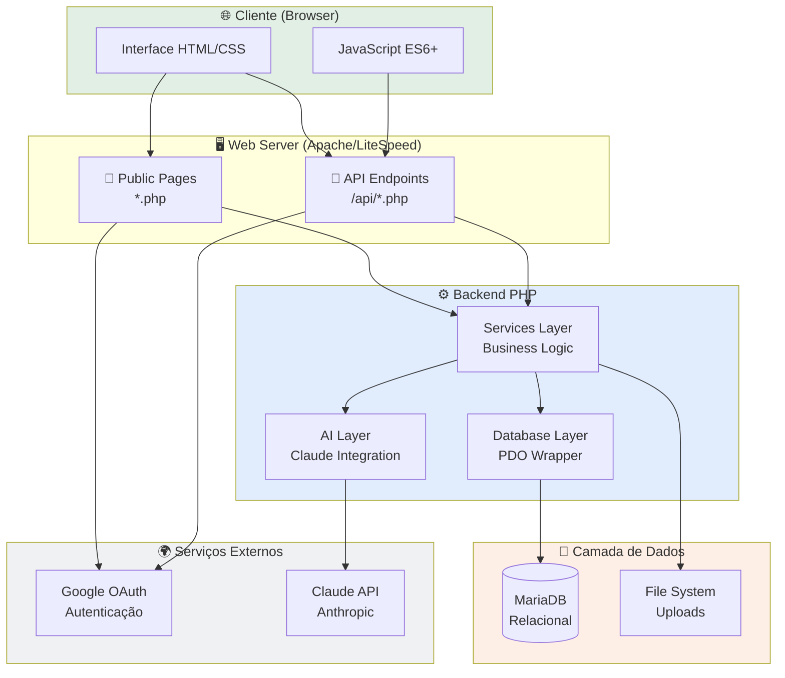
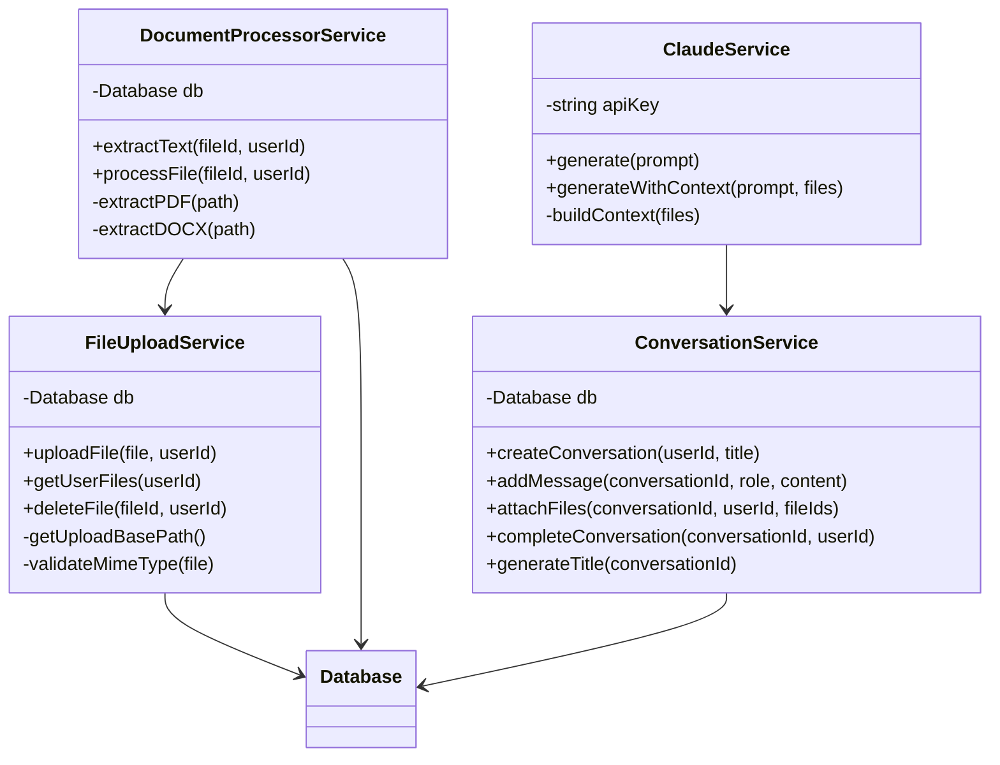
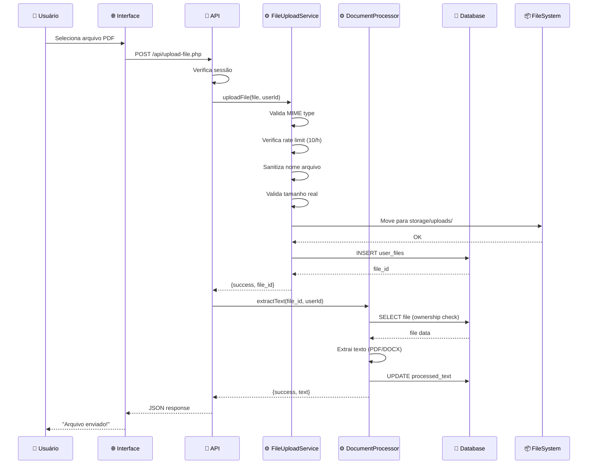
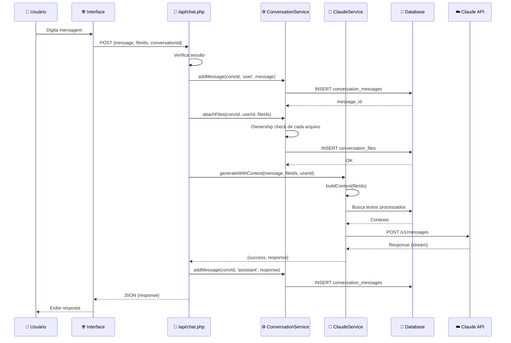

# 🏗️ Arquitetura do Sistema

## Visão Geral

A Plataforma Sunyata segue uma **arquitetura em camadas** (layered architecture) com separação clara de responsabilidades.

### Diagrama de Alto Nível



---

## Camadas da Aplicação

### 1. 🌐 Presentation Layer (Frontend)

**Responsabilidade:** Interface do usuário

**Tecnologias:**
- HTML5 semântico
- Bootstrap 5.3.2 (UI Framework)
- Vanilla JavaScript (ES6+)
- Fetch API para AJAX

**Arquivos principais:**
```
public/
├── dashboard.php           # Dashboard principal
├── onboarding-step2.php   # Onboarding
├── areas/*/index.php      # Verticais
└── assets/
    ├── css/style.css
    └── js/app.js
```

**Exemplo de comunicação com API:**
```javascript
// public/assets/js/app.js
async function uploadFile(file) {
    const formData = new FormData();
    formData.append('file', file);

    const response = await fetch('/api/upload-file.php', {
        method: 'POST',
        body: formData
    });

    const result = await response.json();
    return result;
}
```

---

### 2. 📄 Public Pages Layer

**Responsabilidade:** Páginas web com lógica mínima

**Padrão:**
```php
<?php
// 1. Setup
require_once __DIR__ . '/../config/config.php';
session_start();

// 2. Autenticação
if (!isset($_SESSION['user_id'])) {
    header('Location: /login.php');
    exit;
}

// 3. Lógica de apresentação (mínima)
$userId = $_SESSION['user_id'];
$files = FileUploadService::getInstance()->getUserFiles($userId);

// 4. Render HTML
?>
<!DOCTYPE html>
<html>
...
</html>
```

**Características:**
- ✅ Verificação de sessão
- ✅ Chamadas a Services
- ✅ Render de HTML
- ❌ **NÃO** contém lógica de negócio
- ❌ **NÃO** acessa banco diretamente

---

### 3. 🔌 API Layer

**Responsabilidade:** Endpoints RESTful JSON

**Estrutura:**
```
public/api/
├── upload-file.php         # POST - Upload de arquivo
├── chat.php                # POST - Enviar mensagem
└── export-conversation.php # GET  - Export para PDF
```

**Padrão de Endpoint:**
```php
<?php
// api/upload-file.php

require_once __DIR__ . '/../../config/config.php';
session_start();

header('Content-Type: application/json');

try {
    // 1. Validação de autenticação
    if (!isset($_SESSION['user_id'])) {
        http_response_code(401);
        echo json_encode(['error' => 'Não autenticado']);
        exit;
    }

    // 2. Validação de método HTTP
    if ($_SERVER['REQUEST_METHOD'] !== 'POST') {
        http_response_code(405);
        echo json_encode(['error' => 'Método não permitido']);
        exit;
    }

    // 3. Validação de input
    if (!isset($_FILES['file'])) {
        http_response_code(400);
        echo json_encode(['error' => 'Arquivo não enviado']);
        exit;
    }

    // 4. Chamada ao Service
    $fileService = FileUploadService::getInstance();
    $result = $fileService->uploadFile($_FILES['file'], $_SESSION['user_id']);

    // 5. Response
    if ($result['success']) {
        http_response_code(200);
        echo json_encode($result);
    } else {
        http_response_code(400);
        echo json_encode($result);
    }

} catch (Exception $e) {
    error_log('API Error: ' . $e->getMessage());
    http_response_code(500);
    echo json_encode(['error' => 'Erro interno do servidor']);
}
```

**Características:**
- ✅ Content-Type: application/json
- ✅ HTTP status codes corretos
- ✅ Tratamento de exceções
- ✅ Logging de erros
- ❌ **NÃO** contém lógica de negócio
- ❌ **NÃO** acessa banco diretamente

---

### 4. ⚙️ Services Layer

**Responsabilidade:** Lógica de negócio reutilizável

**Services disponíveis:**



**Padrão de Service (Singleton):**
```php
<?php
namespace App\Services;

use App\Database\Database;

class FileUploadService
{
    private static ?self $instance = null;
    private Database $db;

    private const MAX_FILE_SIZE = 10 * 1024 * 1024; // 10MB
    private const ALLOWED_TYPES = ['application/pdf', 'application/vnd.openxmlformats-officedocument.wordprocessingml.document'];

    private function __construct()
    {
        $this->db = Database::getInstance();
    }

    public static function getInstance(): self
    {
        if (self::$instance === null) {
            self::$instance = new self();
        }
        return self::$instance;
    }

    public function uploadFile(array $fileData, int $userId): array
    {
        // Lógica de negócio...
    }
}
```

**Características:**
- ✅ Singleton pattern
- ✅ Type hints (PHP 8.2)
- ✅ Namespaces PSR-4
- ✅ Dependency injection (Database)
- ✅ Ownership checks
- ✅ Error handling com try-catch
- ✅ Logging contextual

---

### 5. 🤖 AI Layer

**Responsabilidade:** Integração com Claude API

**ClaudeService:**
```php
<?php
namespace App\AI;

class ClaudeService
{
    private string $apiKey;
    private string $model = 'claude-3-5-sonnet-20241022';

    public function __construct()
    {
        $this->apiKey = $_ENV['ANTHROPIC_API_KEY'];
    }

    /**
     * Gera resposta com contexto de arquivos
     */
    public function generateWithContext(string $userMessage, array $fileIds, int $userId): array
    {
        try {
            // 1. Buscar arquivos e extrair contexto
            $context = $this->buildContext($fileIds, $userId);

            // 2. Construir prompt
            $systemPrompt = "Você é um assistente especializado. Use o contexto abaixo:\n\n";
            $systemPrompt .= $context;

            // 3. Chamar API
            $response = $this->callAPI([
                'model' => $this->model,
                'max_tokens' => 4096,
                'system' => $systemPrompt,
                'messages' => [
                    ['role' => 'user', 'content' => $userMessage]
                ]
            ]);

            return [
                'success' => true,
                'response' => $response['content'][0]['text']
            ];

        } catch (Exception $e) {
            error_log('ClaudeService error: ' . $e->getMessage());
            return [
                'success' => false,
                'message' => 'Erro ao gerar resposta'
            ];
        }
    }

    private function buildContext(array $fileIds, int $userId): string
    {
        $docProcessor = DocumentProcessorService::getInstance();
        $context = "";

        foreach ($fileIds as $fileId) {
            $result = $docProcessor->extractText($fileId, $userId);
            if ($result['success']) {
                $context .= "--- Documento {$fileId} ---\n";
                $context .= $result['text'] . "\n\n";
            }
        }

        return $context;
    }

    private function callAPI(array $payload): array
    {
        $ch = curl_init('https://api.anthropic.com/v1/messages');
        curl_setopt($ch, CURLOPT_RETURNTRANSFER, true);
        curl_setopt($ch, CURLOPT_POST, true);
        curl_setopt($ch, CURLOPT_HTTPHEADER, [
            'Content-Type: application/json',
            'x-api-key: ' . $this->apiKey,
            'anthropic-version: 2023-06-01'
        ]);
        curl_setopt($ch, CURLOPT_POSTFIELDS, json_encode($payload));

        $response = curl_exec($ch);
        $httpCode = curl_getinfo($ch, CURLINFO_HTTP_CODE);
        curl_close($ch);

        if ($httpCode !== 200) {
            throw new Exception("API returned status $httpCode");
        }

        return json_decode($response, true);
    }
}
```

---

### 6. 💾 Database Layer

**Responsabilidade:** Abstração de acesso ao banco

**Database.php (PDO Wrapper):**
```php
<?php
namespace App\Database;

use PDO;

class Database
{
    private static ?self $instance = null;
    private PDO $pdo;

    private function __construct()
    {
        $host = $_ENV['DB_HOST'];
        $name = $_ENV['DB_NAME'];
        $user = $_ENV['DB_USER'];
        $pass = $_ENV['DB_PASS'];

        $dsn = "mysql:host={$host};dbname={$name};charset=utf8mb4";

        $this->pdo = new PDO($dsn, $user, $pass, [
            PDO::ATTR_ERRMODE => PDO::ERRMODE_EXCEPTION,
            PDO::ATTR_DEFAULT_FETCH_MODE => PDO::FETCH_ASSOC,
            PDO::ATTR_EMULATE_PREPARES => false
        ]);
    }

    public static function getInstance(): self
    {
        if (self::$instance === null) {
            self::$instance = new self();
        }
        return self::$instance;
    }

    /**
     * Fetch single row
     */
    public function fetchOne(string $query, array $params = []): ?array
    {
        $stmt = $this->pdo->prepare($query);
        $stmt->execute($params);
        $result = $stmt->fetch();
        return $result ?: null;
    }

    /**
     * Fetch multiple rows
     */
    public function fetchAll(string $query, array $params = []): array
    {
        $stmt = $this->pdo->prepare($query);
        $stmt->execute($params);
        return $stmt->fetchAll();
    }

    /**
     * Insert and return last ID
     */
    public function insert(string $table, array $data): int
    {
        $columns = implode(', ', array_keys($data));
        $placeholders = ':' . implode(', :', array_keys($data));

        $query = "INSERT INTO {$table} ({$columns}) VALUES ({$placeholders})";

        $stmt = $this->pdo->prepare($query);
        $stmt->execute($data);

        return (int) $this->pdo->lastInsertId();
    }

    /**
     * Update rows
     */
    public function update(string $table, array $data, string $where, array $whereParams): int
    {
        $set = [];
        foreach (array_keys($data) as $column) {
            $set[] = "{$column} = :{$column}";
        }
        $setClause = implode(', ', $set);

        $query = "UPDATE {$table} SET {$setClause} WHERE {$where}";

        $stmt = $this->pdo->prepare($query);
        $stmt->execute(array_merge($data, $whereParams));

        return $stmt->rowCount();
    }
}
```

**Características:**
- ✅ Singleton
- ✅ PDO preparado statements
- ✅ Named parameters
- ✅ Error mode exception
- ✅ UTF-8 charset
- ❌ **NÃO** permite queries concatenadas

---

## Fluxo de Dados

### Upload de Arquivo



### Conversa com IA



---

## Padrões Arquiteturais Utilizados

### 1. Singleton Pattern

**Usado em:** Todos os Services + Database

**Por quê:**
- Evita múltiplas conexões ao banco
- Centraliza configuração
- Facilita testing (mockable)

### 2. Repository Pattern (Simplificado)

**Usado em:** Database wrapper

**Por quê:**
- Abstrai SQL do business logic
- Facilita mudança de banco
- Centraliza queries

### 3. Service Layer Pattern

**Usado em:** Services

**Por quê:**
- Separa business logic da apresentação
- Reutilizável entre Public Pages e APIs
- Testável isoladamente

### 4. Dependency Injection (Manual)

**Usado em:** Services recebem Database no construtor

```php
private function __construct()
{
    $this->db = Database::getInstance();
}
```

---

## Decisões Arquiteturais

### Por que não usar Framework?

**Decisão:** PHP puro ao invés de Laravel/Symfony

**Razões:**
1. **MVP-first** - Framework adiciona overhead
2. **Hospedagem compartilhada** - Composer ok, mas não controle total
3. **Aprendizado** - Filipe quer entender fundamentos PHP
4. **Simplicidade** - Menos abstrações = menos magic

**Trade-off aceito:** Menos conveniences, mais controle

### Por que Services e não apenas procedural?

**Decisão:** OOP com Services ao invés de funções soltas

**Razões:**
1. **Reutilização** - Mesma lógica em Public Pages e APIs
2. **Testabilidade** - Isolar lógica
3. **Manutenibilidade** - Código organizado
4. **Escalabilidade** - Fácil adicionar features

### Por que PDO Wrapper e não ORM?

**Decisão:** Database wrapper simples ao invés de Eloquent/Doctrine

**Razões:**
1. **Performance** - ORM adiciona overhead
2. **Controle** - Queries explícitas
3. **Debugging** - SQL visível
4. **Aprendizado** - Entender SQL real

---

<div style="text-align: center; margin: 40px 0; padding: 20px; background: #1f6feb22; border-radius: 8px;">
  <p style="font-size: 14px;">
    ← <a href="01-visao-geral.md">Visão Geral</a> |
    <a href="03-stack.md">Stack Tecnológico →</a>
  </p>
</div>
