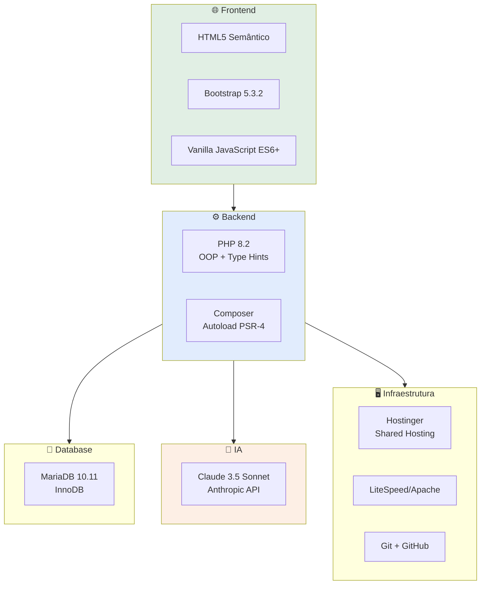

# 🛠️ Stack Tecnológico

## Visão Geral da Stack



---

## 🌐 Frontend

### HTML5

**Versão:** HTML5 com semântica moderna

**Características usadas:**
- Tags semânticas (`<header>`, `<nav>`, `<main>`, `<section>`)
- Forms com validation HTML5
- Data attributes para JavaScript
- Meta tags responsivas

**Exemplo:**
```html
<!DOCTYPE html>
<html lang="pt-BR">
<head>
    <meta charset="UTF-8">
    <meta name="viewport" content="width=device-width, initial-scale=1.0">
    <title>Plataforma Sunyata</title>
</head>
<body>
    <main role="main">
        <section id="dashboard">
            <!-- Conteúdo -->
        </section>
    </main>
</body>
</html>
```

---

### Bootstrap 5.3.2

**Por quê Bootstrap?**
- ✅ UI profissional sem escrever CSS do zero
- ✅ Componentes prontos (modals, cards, forms)
- ✅ Grid system responsivo
- ✅ Suporte mobile-first
- ✅ Amplamente documentado

**CDN usado:**
```html
<link href="https://cdn.jsdelivr.net/npm/bootstrap@5.3.2/dist/css/bootstrap.min.css" rel="stylesheet">
<script src="https://cdn.jsdelivr.net/npm/bootstrap@5.3.2/dist/js/bootstrap.bundle.min.js"></script>
```

**Componentes mais usados:**
- Cards (exibir arquivos e conversas)
- Modals (confirmações)
- Forms (upload, chat)
- Alerts (mensagens de feedback)
- Navbar (navegação)

**Customizações:**
```css
/* assets/css/style.css */
:root {
    --bs-primary: #1f6feb;
    --bs-dark: #0d1117;
}

.card {
    border-radius: 8px;
    box-shadow: 0 2px 8px rgba(0,0,0,0.1);
}
```

---

### JavaScript (Vanilla ES6+)

**Por quê Vanilla e não React/Vue?**
- ✅ MVP-first - Menos complexidade
- ✅ Zero build step necessário
- ✅ Carregamento rápido
- ✅ Suficiente para interações necessárias

**Features ES6+ usadas:**
- `async/await` - Requisições assíncronas
- `fetch()` - AJAX sem jQuery
- Arrow functions
- Template literals
- Destructuring
- Modules (quando necessário)

**Exemplo típico:**
```javascript
// assets/js/app.js

// Upload de arquivo
async function uploadFile(file) {
    const formData = new FormData();
    formData.append('file', file);

    try {
        const response = await fetch('/api/upload-file.php', {
            method: 'POST',
            body: formData
        });

        const result = await response.json();

        if (result.success) {
            showAlert('success', 'Arquivo enviado com sucesso!');
            refreshFileList();
        } else {
            showAlert('danger', result.message);
        }
    } catch (error) {
        showAlert('danger', 'Erro ao enviar arquivo');
        console.error(error);
    }
}

// Event listener
document.getElementById('uploadBtn').addEventListener('click', () => {
    const fileInput = document.getElementById('fileInput');
    const file = fileInput.files[0];
    if (file) {
        uploadFile(file);
    }
});

// Helper functions
function showAlert(type, message) {
    const alertDiv = document.createElement('div');
    alertDiv.className = `alert alert-${type}`;
    alertDiv.textContent = message;
    document.getElementById('alerts').appendChild(alertDiv);

    setTimeout(() => alertDiv.remove(), 5000);
}
```

---

## ⚙️ Backend

### PHP 8.2

**Por quê PHP 8.2?**
- ✅ Suportado pelo Hostinger
- ✅ Type hints e return types rigorosos
- ✅ Readonly properties
- ✅ Null-safe operator (`?->`)
- ✅ Named arguments
- ✅ Match expressions

**Features PHP 8.2 usadas:**

**1. Strict Types:**
```php
<?php
declare(strict_types=1);

namespace App\Services;

class FileUploadService
{
    public function uploadFile(array $fileData, int $userId): array
    {
        // Type hints garantem tipos corretos
    }
}
```

**2. Readonly Properties:**
```php
class ClaudeService
{
    public function __construct(
        private readonly string $apiKey,
        private readonly string $model = 'claude-3-5-sonnet-20241022'
    ) {}
}
```

**3. Null-safe Operator:**
```php
// Ao invés de:
$title = isset($conversation['title']) ? $conversation['title'] : 'Sem título';

// Usa:
$title = $conversation?->title ?? 'Sem título';
```

**4. Match Expression:**
```php
$status = match($conversation['status']) {
    'active' => 'Ativa',
    'completed' => 'Concluída',
    'archived' => 'Arquivada',
    default => 'Desconhecido'
};
```

---

### Composer

**Versão:** 2.x

**Uso:**
- Autoload PSR-4
- Gerenciamento de dependências
- Geração de autoload otimizado

**composer.json:**
```json
{
    "name": "sunyata/plataforma",
    "description": "Plataforma Sunyata MVP Canvas",
    "type": "project",
    "require": {
        "php": ">=8.2",
        "ext-pdo": "*",
        "ext-curl": "*",
        "ext-mbstring": "*"
    },
    "autoload": {
        "psr-4": {
            "App\\": "src/"
        }
    }
}
```

**Autoload gerado:**
```php
// Em qualquer arquivo:
require_once __DIR__ . '/vendor/autoload.php';

// Agora pode usar:
use App\Services\FileUploadService;
use App\Database\Database;

$service = FileUploadService::getInstance();
```

---

## 💾 Database

### MariaDB 10.11

**Por quê MariaDB?**
- ✅ Fornecido pelo Hostinger
- ✅ Compatível com MySQL
- ✅ Open source
- ✅ Performance superior ao MySQL em muitos casos

**Engine:** InnoDB (transacional, foreign keys)

**Charset:** utf8mb4 (suporta emojis)

**Collation:** utf8mb4_unicode_ci

**Tabelas principais:**
```sql
-- Usuários
users (id, email, name, google_id, vertical, onboarding_status)

-- Arquivos
user_files (id, user_id, original_name, stored_name, mime_type, file_size, processed_text)

-- Conversas
conversations (id, user_id, title, status, created_at, updated_at)

-- Mensagens
conversation_messages (id, conversation_id, role, content, created_at)

-- Anexos
conversation_files (conversation_id, file_id)
```

**Constraints importantes:**
```sql
-- Foreign Keys
ALTER TABLE user_files ADD CONSTRAINT fk_user
    FOREIGN KEY (user_id) REFERENCES users(id) ON DELETE CASCADE;

-- Índices
CREATE INDEX idx_user_files_user ON user_files(user_id);
CREATE INDEX idx_conversations_user ON conversations(user_id);
CREATE INDEX idx_messages_conversation ON conversation_messages(conversation_id);

-- Unique constraints
CREATE UNIQUE INDEX unique_conversation_file ON conversation_files(conversation_id, file_id);
```

---

### PDO (PHP Data Objects)

**Por quê PDO?**
- ✅ Abstração de database
- ✅ Prepared statements (segurança)
- ✅ Named parameters
- ✅ Exception mode

**Configuração:**
```php
$pdo = new PDO($dsn, $user, $pass, [
    PDO::ATTR_ERRMODE => PDO::ERRMODE_EXCEPTION,  // Lança exceções
    PDO::ATTR_DEFAULT_FETCH_MODE => PDO::FETCH_ASSOC,  // Array associativo
    PDO::ATTR_EMULATE_PREPARES => false  // Prepared statements reais
]);
```

**Uso seguro:**
```php
// ✅ CORRETO - Prepared statement
$stmt = $pdo->prepare("SELECT * FROM users WHERE email = :email");
$stmt->execute(['email' => $email]);
$user = $stmt->fetch();

// ❌ ERRADO - SQL injection!
$query = "SELECT * FROM users WHERE email = '$email'";
$result = $pdo->query($query);
```

---

## 🤖 IA (Inteligência Artificial)

### Claude API (Anthropic)

**Modelo:** Claude 3.5 Sonnet (claude-3-5-sonnet-20241022)

**Por quê Claude?**
- ✅ 200k tokens de contexto (ideal para documentos)
- ✅ Melhor compreensão de português
- ✅ Menos censura que GPT-4
- ✅ API simples e bem documentada
- ✅ Streaming de respostas

**Endpoint:** `https://api.anthropic.com/v1/messages`

**Autenticação:** Header `x-api-key`

**Request básico:**
```php
$payload = [
    'model' => 'claude-3-5-sonnet-20241022',
    'max_tokens' => 4096,
    'system' => 'Você é um assistente especializado...',
    'messages' => [
        ['role' => 'user', 'content' => 'Pergunta do usuário']
    ]
];

$ch = curl_init('https://api.anthropic.com/v1/messages');
curl_setopt($ch, CURLOPT_RETURNTRANSFER, true);
curl_setopt($ch, CURLOPT_POST, true);
curl_setopt($ch, CURLOPT_HTTPHEADER, [
    'Content-Type: application/json',
    'x-api-key: ' . $apiKey,
    'anthropic-version: 2023-06-01'
]);
curl_setopt($ch, CURLOPT_POSTFIELDS, json_encode($payload));

$response = curl_exec($ch);
```

**Response:**
```json
{
  "id": "msg_xxx",
  "type": "message",
  "role": "assistant",
  "content": [
    {
      "type": "text",
      "text": "Resposta do Claude..."
    }
  ],
  "model": "claude-3-5-sonnet-20241022",
  "usage": {
    "input_tokens": 123,
    "output_tokens": 456
  }
}
```

**Custos (aproximados):**
- Input: $3 / 1M tokens
- Output: $15 / 1M tokens

---

## 🖥️ Infraestrutura

### Hostinger (Shared Hosting)

**Plano:** Shared Hosting (Business)

**Specs:**
- CPU: Compartilhada
- RAM: Limite variável
- Storage: SSD
- PHP: 8.2
- MariaDB: 10.11
- Web Server: LiteSpeed

**Acesso:**
```bash
ssh -p 65002 u202164171@82.25.72.226
```

**Estrutura de diretórios:**
```
/home/u202164171/
├── domains/
│   ├── sunyataconsulting.com/
│   │   └── public_html/
│   │       └── plataforma-sunyata/    # ← Projeto aqui
│   └── portal.sunyataconsulting.com/
│       └── public_html/               # Aponta para plataforma-sunyata/public/
└── storage/
    └── uploads/                       # Arquivos enviados
```

**Limitações conhecidas:**
- ❌ Sem acesso root
- ❌ Sem configuração Apache direta
- ❌ Recursos compartilhados
- ✅ SSH disponível
- ✅ Composer funciona
- ✅ Cron jobs disponíveis

---

### Git & GitHub

**Repositório:** https://github.com/iflitaiff/plataforma-sunyata

**Branch strategy:**
- `main` - Produção estável
- `feature/*` - Features em desenvolvimento
- `hotfix/*` - Correções urgentes

**Workflow atual:**
```bash
# Desenvolvimento local
git checkout -b feature/nova-feature
# ... desenvolvimento ...
git add .
git commit -m "feat: Nova feature"

# Push para GitHub
git push origin feature/nova-feature

# Deploy para produção (manual)
git checkout feature/nova-feature
scp -r -P 65002 src/ public/ u202164171@82.25.72.226:/home/.../plataforma-sunyata/
```

**Commits convencionais:**
- `feat:` - Nova feature
- `fix:` - Bug fix
- `docs:` - Documentação
- `refactor:` - Refatoração
- `test:` - Testes
- `chore:` - Manutenção

---

## 📦 Dependências e Libs

### Atual (Mínimas)

**Backend:**
- Nenhuma lib externa além de extensões PHP nativas
- PDO (builtin)
- cURL (builtin)

**Frontend:**
- Bootstrap 5.3.2 (CDN)
- Sem jQuery
- Sem frameworks JS

### Planejadas para Futuro

**Backend:**
- `mpdf/mpdf` - Geração de PDFs
- `phpoffice/phpword` - Processamento DOCX melhor
- `vlucas/phpdotenv` - Gestão de .env

**Frontend:**
- Alpine.js (se precisar reatividade leve)
- Chart.js (se precisar gráficos)

---

## 🔧 Ferramentas de Desenvolvimento

**Editor:** VS Code / Claude Code CLI

**Extensions úteis:**
- PHP Intelephense
- Bootstrap IntelliSense
- ESLint
- GitLens

**Testing local:**
```bash
# PHP built-in server
php -S localhost:8000 -t public/

# Ou Apache/Nginx local
```

**Debugging:**
```php
// Development
ini_set('display_errors', 1);
error_reporting(E_ALL);

// Production
ini_set('display_errors', 0);
error_log($message);  // Vai para arquivo de log
```

---

## 📊 Comparação de Alternativas

### Por que não usar...

**Laravel?**
- ❌ Overhead grande para MVP
- ❌ Hosting compartilhado tem limitações
- ✅ MAS: Seria ideal para escala futura

**React/Vue/Next.js?**
- ❌ Build step adiciona complexidade
- ❌ SEO não é prioridade
- ❌ Não precisamos SPA
- ✅ MAS: Consideraremos se UI ficar muito dinâmica

**PostgreSQL?**
- ❌ Hostinger não oferece
- ❌ MariaDB é suficiente
- ✅ MAS: PostgreSQL seria melhor para JSONB

**OpenAI GPT-4?**
- ❌ Contexto menor (128k vs 200k)
- ❌ Mais caro
- ❌ Censura mais agressiva
- ✅ MAS: GPT-4 é mais popular

---

<div style="text-align: center; margin: 40px 0; padding: 20px; background: #1f6feb22; border-radius: 8px;">
  <p style="font-size: 14px;">
    ← <a href="02-arquitetura.md">Arquitetura</a> |
    <a href="glossario.md">Glossário Técnico →</a>
  </p>
</div>
