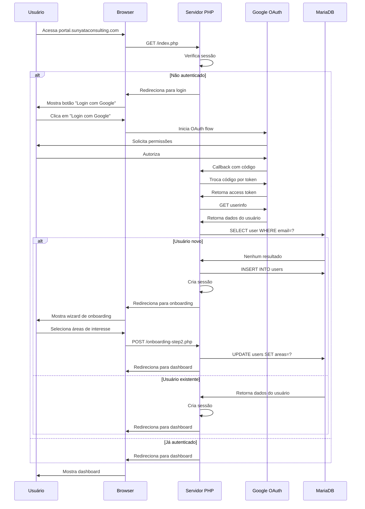
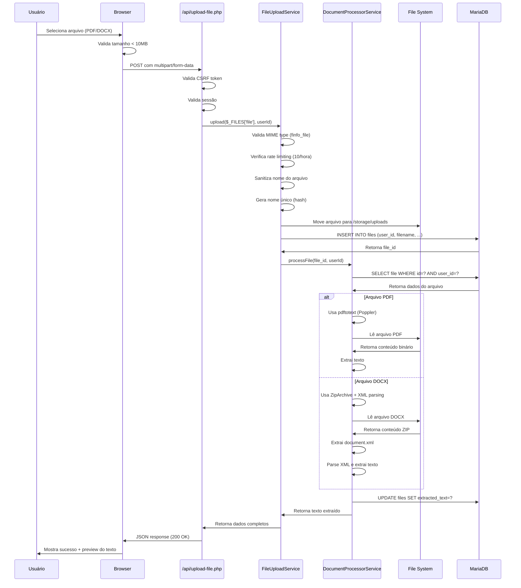
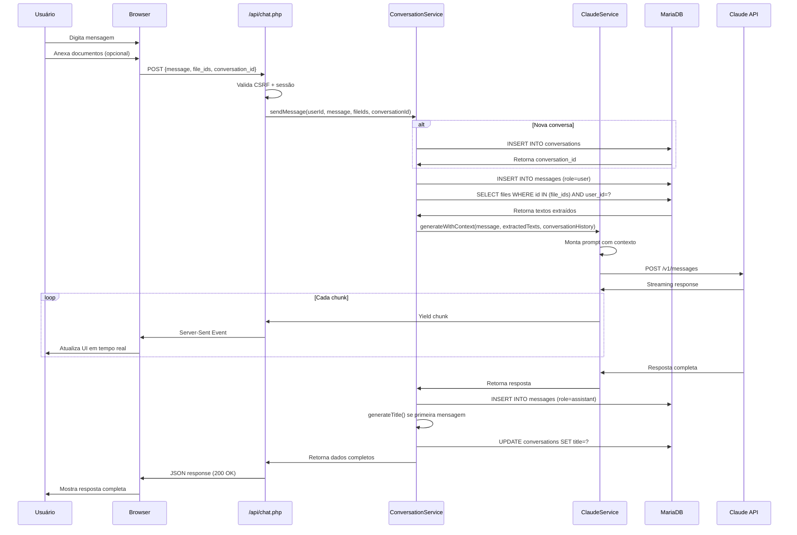
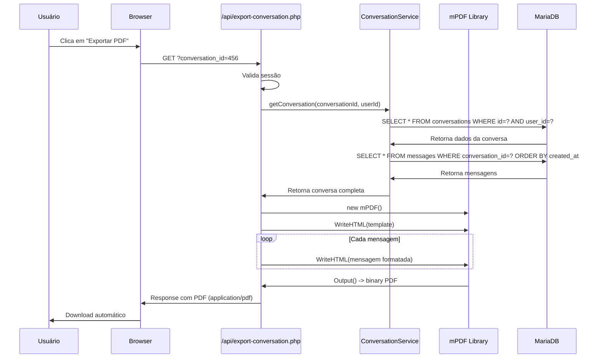
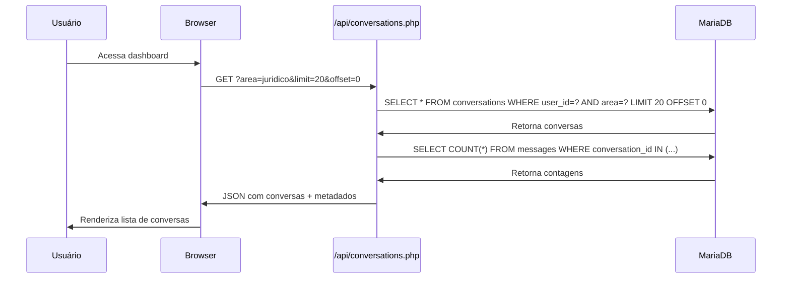
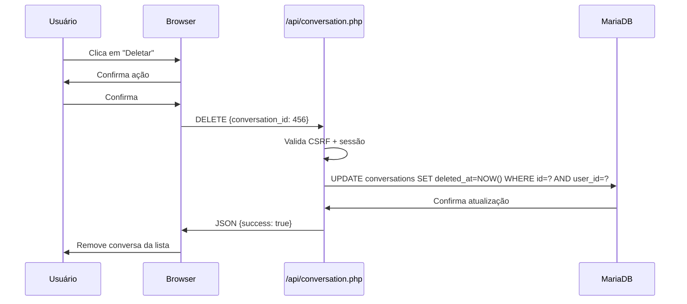

# 🔄 Fluxos Principais

> **Status:** ✅ Documentação completa dos fluxos implementados

Esta seção documenta os fluxos principais da Plataforma Sunyata com diagramas de sequência.

---

## 📋 Visão Geral

A Plataforma Sunyata possui 5 fluxos principais:

1. **Autenticação e Onboarding** - Login com Google OAuth e configuração inicial
2. **Upload e Processamento de Documento** - Upload de PDF/DOCX com extração de texto
3. **Conversa com IA** - Chat com Claude AI com contexto de documentos
4. **Exportação de Conversa** - Geração de PDF da conversa
5. **Gerenciamento de Conversas** - Listagem, busca e exclusão

---

## 1️⃣ Autenticação e Onboarding

Fluxo completo desde o primeiro acesso até o dashboard.

### Diagrama de Sequência



### Passos Detalhados

#### 1. Primeiro Acesso
```
1. Usuário acessa portal.sunyataconsulting.com
2. Servidor verifica sessão (não existe)
3. Redireciona para /index.php (página de login)
```

#### 2. Login com Google
```
4. Usuário clica em "Login com Google"
5. Redireciona para Google OAuth
6. Google solicita permissões (email, profile)
7. Usuário autoriza
8. Google redireciona para callback com código
```

#### 3. Processamento do Callback
```
9. Servidor troca código por access token
10. Servidor obtém dados do usuário (email, nome, foto)
11. Servidor verifica se usuário existe no banco
```

#### 4. Onboarding (Usuário Novo)
```
12. Se usuário não existe:
    a. Cria registro na tabela users
    b. Cria sessão PHP
    c. Redireciona para onboarding-step2.php
13. Usuário seleciona áreas de interesse (Docência, Pesquisa, Jurídico)
14. Servidor atualiza registro do usuário
15. Redireciona para dashboard
```

#### 5. Dashboard (Usuário Existente)
```
16. Se usuário existe:
    a. Cria sessão PHP
    b. Redireciona diretamente para dashboard
```

### Dados Armazenados na Sessão

```php
$_SESSION = [
    'user_id' => 123,
    'email' => 'usuario@example.com',
    'name' => 'João Silva',
    'picture' => 'https://lh3.googleusercontent.com/...',
    'areas' => ['juridico', 'pesquisa'],
    'csrf_token' => 'abc123...'
];
```

---

## 2️⃣ Upload e Processamento de Documento

Fluxo de upload de PDF/DOCX com extração automática de texto.

### Diagrama de Sequência



### Passos Detalhados

#### 1. Seleção e Validação no Frontend
```javascript
// 1. Usuário seleciona arquivo
const fileInput = document.getElementById('file');
fileInput.addEventListener('change', async (e) => {
    const file = e.target.files[0];
    
    // 2. Valida tamanho (< 10MB)
    if (file.size > 10 * 1024 * 1024) {
        alert('Arquivo muito grande! Máximo: 10MB');
        return;
    }
    
    // 3. Valida tipo
    const allowedTypes = ['application/pdf', 'application/vnd.openxmlformats-officedocument.wordprocessingml.document'];
    if (!allowedTypes.includes(file.type)) {
        alert('Tipo não permitido! Apenas PDF ou DOCX');
        return;
    }
    
    // 4. Envia para API
    await uploadFile(file);
});
```

#### 2. Processamento no Backend
```php
// FileUploadService::upload()
public function upload(array $file, int $userId): array {
    // 1. Valida MIME type real (não confia no cliente)
    $finfo = finfo_open(FILEINFO_MIME_TYPE);
    $mimeType = finfo_file($finfo, $file['tmp_name']);
    
    // 2. Verifica rate limiting
    $uploadCount = $this->getUploadCountLastHour($userId);
    if ($uploadCount >= 10) {
        throw new Exception('Limite de uploads excedido');
    }
    
    // 3. Sanitiza nome
    $safeName = preg_replace('/[^a-zA-Z0-9_\-\.]/', '_', $file['name']);
    
    // 4. Gera nome único
    $hash = hash('sha256', $userId . time() . $safeName);
    $uniqueName = substr($hash, 0, 16) . '_' . $safeName;
    
    // 5. Move arquivo
    $uploadPath = $this->getUploadBasePath() . '/' . $uniqueName;
    move_uploaded_file($file['tmp_name'], $uploadPath);
    
    // 6. Salva no banco
    $fileId = $this->db->insert('files', [
        'user_id' => $userId,
        'filename' => $uniqueName,
        'original_name' => $safeName,
        'file_size' => filesize($uploadPath),
        'mime_type' => $mimeType
    ]);
    
    // 7. Processa documento
    $extractedText = $this->documentProcessor->processFile($fileId, $userId);
    
    return [
        'file_id' => $fileId,
        'filename' => $uniqueName,
        'extracted_text' => $extractedText
    ];
}
```

#### 3. Extração de Texto
```php
// DocumentProcessorService::extractText()
private function extractText(string $filePath, string $mimeType): string {
    if ($mimeType === 'application/pdf') {
        // PDF: usa pdftotext (Poppler)
        $output = shell_exec("pdftotext " . escapeshellarg($filePath) . " -");
        return $output;
    } elseif ($mimeType === 'application/vnd.openxmlformats-officedocument.wordprocessingml.document') {
        // DOCX: usa ZipArchive + XML parsing
        $zip = new ZipArchive();
        $zip->open($filePath);
        $xml = $zip->getFromName('word/document.xml');
        $zip->close();
        
        // Parse XML e extrai texto
        $dom = new DOMDocument();
        $dom->loadXML($xml);
        $texts = $dom->getElementsByTagName('t');
        
        $result = '';
        foreach ($texts as $text) {
            $result .= $text->nodeValue . ' ';
        }
        
        return trim($result);
    }
}
```

### Tratamento de Erros

| Erro | Código | Ação |
|------|--------|------|
| Arquivo muito grande | 413 | Mostra mensagem + sugere compressão |
| Tipo inválido | 400 | Mostra tipos permitidos |
| Rate limit | 429 | Mostra tempo até reset |
| Falha na extração | 500 | Salva arquivo mas marca como "processamento pendente" |

---

## 3️⃣ Conversa com IA

Fluxo de chat com Claude AI incluindo contexto de documentos.

### Diagrama de Sequência



### Passos Detalhados

#### 1. Preparação da Mensagem
```javascript
// Frontend
async function sendMessage(message, fileIds = [], conversationId = null) {
    const response = await fetch('/api/chat.php', {
        method: 'POST',
        headers: {
            'Content-Type': 'application/json',
            'X-CSRF-Token': csrfToken
        },
        body: JSON.stringify({
            message: message,
            file_ids: fileIds,
            conversation_id: conversationId,
            stream: true
        })
    });
    
    // Processa streaming
    const reader = response.body.getReader();
    const decoder = new TextDecoder();
    
    while (true) {
        const {done, value} = await reader.read();
        if (done) break;
        
        const chunk = decoder.decode(value);
        updateUI(chunk);
    }
}
```

#### 2. Processamento no Backend
```php
// ConversationService::sendMessage()
public function sendMessage(int $userId, string $message, array $fileIds = [], ?int $conversationId = null): array {
    // 1. Cria ou valida conversa
    if ($conversationId === null) {
        $conversationId = $this->createConversation($userId);
    } else {
        $this->validateOwnership($conversationId, $userId);
    }
    
    // 2. Salva mensagem do usuário
    $this->addMessage($conversationId, 'user', $message);
    
    // 3. Carrega contexto dos arquivos
    $context = [];
    foreach ($fileIds as $fileId) {
        $file = $this->getFile($fileId, $userId);
        $context[] = [
            'filename' => $file['original_name'],
            'content' => $file['extracted_text']
        ];
    }
    
    // 4. Carrega histórico da conversa
    $history = $this->getConversationHistory($conversationId);
    
    // 5. Gera resposta com Claude
    $response = $this->claudeService->generateWithContext(
        $message,
        $context,
        $history
    );
    
    // 6. Salva resposta
    $this->addMessage($conversationId, 'assistant', $response);
    
    // 7. Gera título se primeira mensagem
    if (count($history) === 0) {
        $title = $this->generateTitle($message, $response);
        $this->updateConversationTitle($conversationId, $title);
    }
    
    return [
        'conversation_id' => $conversationId,
        'response' => $response
    ];
}
```

#### 3. Geração de Resposta com Claude
```php
// ClaudeService::generateWithContext()
public function generateWithContext(string $userMessage, array $documents = [], array $history = []): string {
    // 1. Monta contexto dos documentos
    $contextText = '';
    foreach ($documents as $doc) {
        $contextText .= "Documento: {$doc['filename']}\n";
        $contextText .= "Conteúdo: {$doc['content']}\n\n";
    }
    
    // 2. Monta mensagens
    $messages = [];
    
    // Adiciona histórico
    foreach ($history as $msg) {
        $messages[] = [
            'role' => $msg['role'],
            'content' => $msg['content']
        ];
    }
    
    // Adiciona mensagem atual com contexto
    $fullMessage = $contextText ? $contextText . "\n\nPergunta: " . $userMessage : $userMessage;
    $messages[] = [
        'role' => 'user',
        'content' => $fullMessage
    ];
    
    // 3. Chama Claude API
    $response = $this->client->post('/v1/messages', [
        'json' => [
            'model' => 'claude-3-5-sonnet-20241022',
            'max_tokens' => 4096,
            'messages' => $messages,
            'stream' => true
        ]
    ]);
    
    // 4. Processa streaming
    $fullResponse = '';
    foreach ($response->getBody() as $chunk) {
        $data = json_decode($chunk);
        if ($data->type === 'content_block_delta') {
            $fullResponse .= $data->delta->text;
            echo "data: " . json_encode(['type' => 'chunk', 'content' => $data->delta->text]) . "\n\n";
            flush();
        }
    }
    
    return $fullResponse;
}
```

### Otimizações

1. **Truncamento de contexto:** Se texto extraído > 100k caracteres, trunca para primeiros 50k + últimos 50k
2. **Cache de histórico:** Histórico armazenado em sessão para evitar queries repetidas
3. **Streaming:** Resposta enviada em chunks para melhor UX

---

## 4️⃣ Exportação de Conversa

Fluxo de geração de PDF da conversa.

### Diagrama de Sequência



### Template HTML do PDF

```html
<!DOCTYPE html>
<html>
<head>
    <style>
        body { font-family: Arial, sans-serif; }
        .header { background: #4A90E2; color: white; padding: 20px; }
        .message { margin: 20px 0; padding: 15px; border-radius: 8px; }
        .user { background: #E3F2FD; }
        .assistant { background: #F5F5F5; }
        .timestamp { font-size: 12px; color: #666; }
    </style>
</head>
<body>
    <div class="header">
        <h1><?= htmlspecialchars($conversation['title']) ?></h1>
        <p>Área: <?= htmlspecialchars($conversation['area']) ?></p>
        <p>Data: <?= date('d/m/Y H:i', strtotime($conversation['created_at'])) ?></p>
    </div>
    
    <?php foreach ($messages as $msg): ?>
    <div class="message <?= $msg['role'] ?>">
        <div class="timestamp"><?= date('d/m/Y H:i', strtotime($msg['created_at'])) ?></div>
        <p><?= nl2br(htmlspecialchars($msg['content'])) ?></p>
    </div>
    <?php endforeach; ?>
</body>
</html>
```

---

## 5️⃣ Gerenciamento de Conversas

Fluxo de listagem, busca e exclusão de conversas.

### Diagrama de Listagem



### Diagrama de Exclusão



---

## 📊 Métricas de Performance

| Fluxo | Tempo Médio | Gargalo Principal |
|-------|-------------|-------------------|
| Login + Onboarding | 3-5s | Google OAuth (rede) |
| Upload + Processamento | 2-4s | Extração de texto (CPU) |
| Chat (primeira mensagem) | 4-6s | Claude API (rede) |
| Chat (mensagens seguintes) | 3-5s | Claude API (rede) |
| Exportação PDF | 1-2s | Geração HTML + PDF (CPU) |
| Listagem conversas | 100-200ms | Query ao banco |

---

## 🔧 Troubleshooting

Para problemas comuns nestes fluxos, consulte [Troubleshooting](12-troubleshooting.md).

---

**Última atualização:** 2025-10-22  
**Versão:** v2.0

