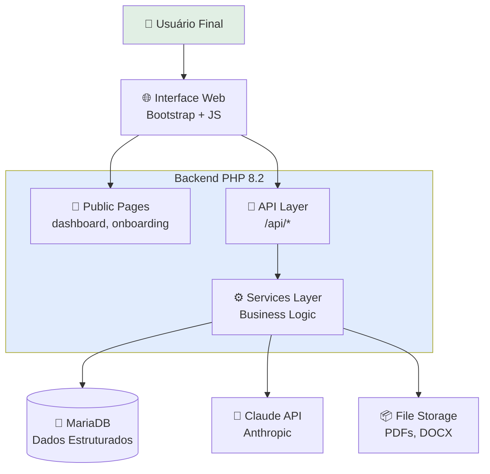

# 📖 Plataforma Sunyata - Documentação Técnica

> Documentação viva e técnica da Plataforma Sunyata - MVP Canvas com IA Generativa

---

## 🎯 Bem-vindo

Esta é a documentação técnica **consolidada e sempre atualizada** da Plataforma Sunyata. Ela foi criada para:

- ✅ **Situar você na arquitetura** e decisões técnicas
- ✅ **Documentar tecnologias** empregadas (PHP, JavaScript, Claude API)
- ✅ **Rastrear evolução** através dos sprints
- ✅ **Facilitar onboarding** de novos desenvolvedores
- ✅ **Servir como referência** para Manus e equipe

---

## 🚀 Status Atual

<div style="text-align: center; margin: 30px 0;">
  <span class="badge badge-done">Sprint 1: Foundation ✓</span>
  <span class="badge badge-done">Sprint 2: Services Layer ✓</span>
  <span class="badge badge-wip">Sprint 3: APIs (WIP)</span>
</div>

**Última versão:** v2.0 - Sprint 2 Completo
**Branch:** `feature/mvp-admin-canvas`
**Ambiente:** Produção (Hostinger)

### 📊 Métricas do Sprint 2

| Métrica | Valor |
|---------|-------|
| **Bugs corrigidos** | 9 (8 críticos + 1 menor) |
| **Services criados** | 3 (FileUpload, DocumentProcessor, Conversation) |
| **Code reviews** | 2 (Manus AI) |
| **Commits importantes** | 15 |
| **Qualidade média** | 9.6/10 (avaliação Manus) |

---

## 📚 Como Usar Esta Documentação

### 🔍 Navegação

- **Menu lateral (esquerda):** Navegue pelas seções organizadas por tema
- **Busca (canto superior):** Digite qualquer termo técnico
- **Breadcrumbs:** Veja onde você está na hierarquia
- **Anterior/Próximo:** Botões no final de cada página

### 🎨 Convenções Visuais

- 📦 **Código PHP:** Snippets anotados com explicações
- 🔄 **Diagramas Mermaid:** Arquitetura e fluxos renderizados
- 💡 **Glossário:** Termos técnicos marcados assim: <span class="glossary-term">CSRF</span>
- ✅ **Status badges:** <span class="badge badge-done">Concluído</span> <span class="badge badge-wip">Em progresso</span>

### 🎯 Por Onde Começar

**Se você é novo no projeto:**
1. Leia [Visão Geral](01-visao-geral.md) - O que é e por quê
2. Veja [Arquitetura](02-arquitetura.md) - Como está organizado
3. Explore [Fluxos Principais](05-fluxos.md) - Como funciona

**Se você quer implementar algo:**
1. Confira [Stack Tecnológico](03-stack.md) - Ferramentas disponíveis
2. Veja [Estrutura do Projeto](04-estrutura.md) - Onde colocar código
3. Leia [APIs](07-apis.md) - Endpoints disponíveis

**Se você precisa fazer deploy:**
1. Leia [Segurança](08-seguranca.md) - Checklist de segurança
2. Siga [Deployment](09-deployment.md) - Processo de deploy

---

## 🏗️ Arquitetura em 60 Segundos



**Camadas:**
- 🌐 **Frontend:** Bootstrap 5 + Vanilla JavaScript
- 📄 **Public Pages:** Páginas PHP com lógica mínima
- 🔌 **API Layer:** Endpoints RESTful JSON
- ⚙️ **Services Layer:** Lógica de negócio reutilizável (Singleton)
- 💾 **Data Layer:** MariaDB com prepared statements
- 🤖 **AI Layer:** Integração com Claude API (Anthropic)

---

## 🛠️ Stack em Resumo

**Backend:**
- PHP 8.2 (OOP, Namespaces, Type Hints)
- MariaDB 10.11 (Relacional)
- Composer (Autoload PSR-4)

**Frontend:**
- Bootstrap 5.3.2 (UI Framework)
- Vanilla JavaScript (ES6+)
- Fetch API (AJAX)

**IA:**
- Anthropic Claude API (Claude 3.5 Sonnet)
- Streaming de respostas
- Context management

**Infraestrutura:**
- Hostinger Shared Hosting
- SSH + SCP para deploy
- Git (feature branches)

---

## 📋 Sprints & Roadmap

### ✅ Sprint 1: Foundation (Concluído)
- Setup inicial do projeto
- Autenticação e sessões
- Sistema de onboarding
- Verticais (Docência, Pesquisa, Jurídico)

### ✅ Sprint 2: Services Layer (Concluído)
- FileUploadService (upload, validação MIME)
- DocumentProcessorService (extração PDF/DOCX)
- ConversationService (CRUD de conversas)
- Bug fixes de segurança (ownership checks)

### 🔄 Sprint 3: APIs (Em Progresso)
- /api/upload-file.php
- /api/chat.php
- /api/export-conversation.php

[Ver roadmap completo →](10-sprints.md)

---

## 🔒 Segurança

Este projeto segue práticas rigorosas de segurança:

- ✅ **Ownership checks** - Usuários só acessam seus próprios dados
- ✅ **CSRF protection** - Tokens em todas as operações críticas
- ✅ **Rate limiting** - 10 uploads/hora por usuário
- ✅ **Input sanitization** - Path traversal, XSS, SQL injection
- ✅ **Prepared statements** - Zero concatenação SQL
- ✅ **File validation** - MIME type, tamanho real, nome seguro

**Auditoria:** 2 code reviews completos pelo Manus AI (11 bugs detectados, 9 corrigidos)

[Ver detalhes de segurança →](08-seguranca.md)

---

## 🤝 Contribuindo

Esta documentação é viva e evolui com o projeto. Para atualizar:

```bash
# 1. Edite os arquivos .md em public/docs/
# 2. Teste localmente
cd public/docs
python3 -m http.server 8000
# Acesse http://localhost:8000

# 3. Deploy para produção
scp -r -P 65002 public/docs/* u202164171@82.25.72.226:/home/.../public/docs/
```

**Quando atualizar:**
- ✅ Fim de cada sprint
- ✅ Após code review do Manus
- ✅ Após decisões arquiteturais importantes
- ✅ Antes de apresentações/demos

---

## 💬 Comunicação Técnica

Este projeto usa um sistema de comunicação estruturado:

**COMM-BOARD:** [https://portal.sunyataconsulting.com/COMM-BOARD.html](https://portal.sunyataconsulting.com/COMM-BOARD.html)

- 🤖 **Claude Code** posta status de implementações
- 🧠 **Manus AI** posta code reviews
- 👤 **Filipe** posta decisões e prioridades

---

## 📞 Contato

**Product Owner:** Filipe Litaiff
**Email:** flitaiff@gmail.com
**GitHub:** [iflitaiff/plataforma-sunyata](https://github.com/iflitaiff/plataforma-sunyata)

---

<div style="text-align: center; margin: 50px 0;">
  <p style="font-size: 14px; color: #8b949e;">
    Explore as seções usando o menu lateral ←
  </p>
  <p style="font-size: 12px; color: #8b949e;">
    Esta documentação é gerada e mantida por Claude Code
  </p>
</div>
