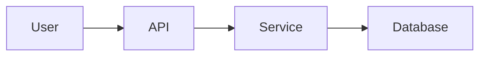

# 📚 Glossário Técnico

> Termos técnicos explicados de forma clara para quem não tem familiaridade com PHP e JavaScript

---

## A

### API (Application Programming Interface)
Interface que permite comunicação entre sistemas. No projeto, usamos APIs para:
- **APIs internas:** `/api/upload-file.php`, `/api/chat.php`
- **APIs externas:** Claude API (Anthropic), Google OAuth

**Exemplo prático:**
```javascript
// Frontend chama API interna
fetch('/api/upload-file.php', {method: 'POST', body: formData})
```

### Autoload
Mecanismo que carrega classes PHP automaticamente sem precisar de `require` manual.

**Sem autoload:**
```php
require_once 'src/Services/FileUploadService.php';
require_once 'src/Services/ConversationService.php';
// ... 50 arquivos ...
```

**Com autoload (PSR-4):**
```php
require_once 'vendor/autoload.php';
use App\Services\FileUploadService;  // Carrega automaticamente!
```

---

## B

### Bootstrap (Framework CSS)
Framework frontend que fornece componentes visuais prontos (botões, formulários, grids, modais).

**Uso no projeto:**
```html
<button class="btn btn-primary">Upload</button>  <!-- Botão estilizado -->
<div class="container">...</div>  <!-- Grid responsivo -->
```

**Benefícios:**
- ✅ Design responsivo (mobile-first)
- ✅ Componentes consistentes
- ✅ Desenvolvimento rápido

---

## C

### CSRF (Cross-Site Request Forgery)
Ataque onde um site malicioso faz requisições em nome do usuário autenticado.

**Proteção:**
```php
// Gera token
$_SESSION['csrf_token'] = bin2hex(random_bytes(32));

// Valida token
if ($_POST['csrf_token'] !== $_SESSION['csrf_token']) {
    die('CSRF attack detected!');
}
```

### Composer
Gerenciador de dependências do PHP (similar ao npm do JavaScript).

**Uso:**
```bash
composer install          # Instala dependências
composer dump-autoload    # Regenera autoload
```

### cURL
Biblioteca para fazer requisições HTTP em PHP.

**Exemplo:**
```php
$ch = curl_init('https://api.example.com/data');
curl_setopt($ch, CURLOPT_RETURNTRANSFER, true);
$response = curl_exec($ch);
curl_close($ch);
```

**Uso no projeto:** Chamadas para Claude API

---

## D

### Dependency Injection
Técnica onde uma classe recebe suas dependências ao invés de criá-las.

**Sem DI (ruim):**
```php
class FileUploadService {
    private $db;

    public function __construct() {
        $this->db = new Database();  // ❌ Acoplado
    }
}
```

**Com DI (bom):**
```php
class FileUploadService {
    public function __construct(
        private Database $db  // ✅ Injetado
    ) {}
}
```

### Docsify
Gerador de sites de documentação que renderiza Markdown em tempo real.

**Características:**
- ✅ Sem build (apenas HTML/JS/CSS)
- ✅ Busca integrada
- ✅ Temas personalizáveis
- ✅ Plugins (Mermaid, syntax highlighting)

**Uso no projeto:** Portal de documentação em `/docs/`

---

## E

### Environment Variables
Variáveis de configuração armazenadas fora do código-fonte.

**Exemplo (.env):**
```bash
DB_HOST=localhost
DB_NAME=sunyata_db
ANTHROPIC_API_KEY=sk-ant-xxx
```

**Acesso em PHP:**
```php
$apiKey = $_ENV['ANTHROPIC_API_KEY'];
```

**Benefícios:**
- ✅ Segurança (não commita secrets)
- ✅ Configuração por ambiente (dev/prod)

---

## F

### Foreign Key
Chave que liga duas tabelas no banco de dados.

**Exemplo:**
```sql
CREATE TABLE user_files (
    id INT PRIMARY KEY,
    user_id INT,
    FOREIGN KEY (user_id) REFERENCES users(id) ON DELETE CASCADE
);
```

Se deletar um user, todos seus files são deletados automaticamente.

### finfo_file()
Função PHP que detecta o MIME type real de um arquivo (não confia no cliente).

**Uso:**
```php
$finfo = finfo_open(FILEINFO_MIME_TYPE);
$mimeType = finfo_file($finfo, $filePath);  // 'application/pdf'
finfo_close($finfo);
```

**Segurança:** Previne upload de arquivos maliciosos disfarçados

---

## H

### HTTP Status Codes
Códigos que indicam o resultado de uma requisição HTTP.

| Código | Significado | Uso no Projeto |
|--------|-------------|----------------|
| 200 | OK | Requisição bem-sucedida |
| 400 | Bad Request | Dados inválidos |
| 401 | Unauthorized | Não autenticado |
| 403 | Forbidden | Sem permissão |
| 404 | Not Found | Recurso não existe |
| 500 | Internal Error | Erro no servidor |

**Exemplo:**
```php
if (!$result['success']) {
    http_response_code(400);
    echo json_encode(['error' => $result['message']]);
}
```

### Hostinger
Provedor de hospedagem web onde a aplicação está deployada.

**Características:**
- Hospedagem compartilhada (LiteSpeed)
- PHP 8.2, MariaDB 10.6
- Acesso SSH limitado
- Painel hPanel para gerenciamento

---

## J

### JSON (JavaScript Object Notation)
Formato de dados leve para comunicação entre cliente e servidor.

**Exemplo:**
```json
{
  "success": true,
  "file_id": 123,
  "message": "Arquivo enviado"
}
```

**Em PHP:**
```php
// Array para JSON
$data = ['success' => true, 'file_id' => 123];
echo json_encode($data);

// JSON para array
$array = json_decode($jsonString, true);
```

---

## L

### Layered Architecture
Padrão arquitetural que organiza código em camadas com responsabilidades distintas.

**Camadas do projeto:**
1. Presentation (Frontend)
2. Public Pages (PHP views)
3. API (Endpoints REST)
4. Services (Lógica de negócio)
5. AI (Claude integration)
6. Database (Acesso a dados)

**Benefício:** Separação de responsabilidades, manutenibilidade

### LiteSpeed
Servidor web usado pelo Hostinger (alternativa ao Apache/Nginx).

**Características:**
- ✅ Performance superior ao Apache
- ✅ Compatível com .htaccess
- ✅ Cache integrado

---

## M

### MariaDB
Sistema de gerenciamento de banco de dados relacional (fork do MySQL).

**Versão no projeto:** 10.6

**Características:**
- ✅ Open source
- ✅ Compatível com MySQL
- ✅ Performance otimizada

### Mermaid
Linguagem para criar diagramas usando texto.

**Exemplo:**


**Uso no projeto:** Diagramas de arquitetura e fluxos na documentação

### MIME Type
Identificador do tipo de um arquivo.

**Exemplos:**
- `application/pdf` → PDF
- `application/vnd.openxmlformats-officedocument.wordprocessingml.document` → DOCX
- `image/png` → PNG
- `text/plain` → TXT

**Uso no projeto:**
```php
$allowedTypes = ['application/pdf', 'application/vnd...docx'];
if (!in_array($_FILES['file']['type'], $allowedTypes)) {
    die('Tipo de arquivo não permitido');
}
```

### MVP (Minimum Viable Product)
Versão mínima de um produto que tem valor para usuários.

**Filosofia MVP-first:**
- ✅ Focar no essencial
- ✅ Validar hipóteses rápido
- ❌ Evitar overengineering

---

## N

### Namespace
Organização de código em "pacotes" para evitar conflitos de nomes.

**Exemplo:**
```php
namespace App\Services;  // Declara namespace

class FileUploadService {}
```

**Uso:**
```php
use App\Services\FileUploadService;  // Importa namespace

$service = new FileUploadService();
```

---

## O

### OAuth 2.0
Protocolo de autenticação que permite login via provedores externos (Google, Facebook).

**Fluxo no projeto:**
1. Usuário clica "Login com Google"
2. Redirecionado para Google
3. Google valida credenciais
4. Retorna para aplicação com token
5. Aplicação cria sessão

**Benefícios:**
- ✅ Não armazena senhas
- ✅ UX melhor (login rápido)
- ✅ Segurança delegada ao Google

### Ownership Check
Verificação se um usuário tem permissão para acessar um recurso.

**Problema sem ownership check:**
```php
// ❌ Usuário pode acessar arquivo de outro!
$file = $db->fetchOne("SELECT * FROM user_files WHERE id = :id", ['id' => $fileId]);
```

**Solução:**
```php
// ✅ Só retorna se for do usuário
$file = $db->fetchOne(
    "SELECT * FROM user_files WHERE id = :id AND user_id = :user_id",
    ['id' => $fileId, 'user_id' => $userId]
);
```

---

## P

### PDO (PHP Data Objects)
Extensão PHP para acesso seguro a bancos de dados.

**Vantagens:**
- ✅ Prepared statements (segurança)
- ✅ Suporta múltiplos bancos
- ✅ Exception mode

**Uso:**
```php
$pdo = new PDO('mysql:host=localhost;dbname=test', 'user', 'pass');
$stmt = $pdo->prepare("SELECT * FROM users WHERE email = :email");
$stmt->execute(['email' => $email]);
$user = $stmt->fetch();
```

### Prepared Statement
Query SQL onde valores são passados separadamente, prevenindo SQL injection.

**Inseguro:**
```php
// ❌ SQL Injection!
$query = "SELECT * FROM users WHERE email = '$email'";
// Se $email = "' OR '1'='1", retorna todos usuários!
```

**Seguro:**
```php
// ✅ Protegido
$stmt = $pdo->prepare("SELECT * FROM users WHERE email = :email");
$stmt->execute(['email' => $email]);
// Valores são escapados automaticamente
```

### PSR-4
Padrão de autoload do PHP que mapeia namespaces para diretórios.

**Configuração:**
```json
"autoload": {
    "psr-4": {
        "App\\": "src/"
    }
}
```

**Mapeamento:**
```
App\Services\FileUploadService
    ↓
src/Services/FileUploadService.php
```

---

## R

### Rate Limiting
Limitar número de operações por período de tempo.

**Exemplo:**
```php
// Só permite 10 uploads por hora
$count = $db->fetchOne(
    "SELECT COUNT(*) FROM user_files
     WHERE user_id = :user_id
     AND created_at > DATE_SUB(NOW(), INTERVAL 1 HOUR)",
    ['user_id' => $userId]
);

if ($count >= 10) {
    die('Limite de uploads excedido');
}
```

### Repository Pattern
Padrão que abstrai acesso a dados, centralizando queries em uma classe.

**Sem Repository:**
```php
// Query espalhada por todo código
$stmt = $pdo->prepare("SELECT * FROM users WHERE id = :id");
$stmt->execute(['id' => $userId]);
```

**Com Repository:**
```php
class UserRepository {
    public function findById(int $id): ?User {
        // Query centralizada
    }
}
```

**Benefício:** Mudanças no banco impactam apenas o Repository

### REST (Representational State Transfer)
Estilo de arquitetura para APIs web.

**Princípios:**
- Usar verbos HTTP corretamente (GET, POST, PUT, DELETE)
- URLs representam recursos
- Stateless (sem estado entre requisições)

**Exemplo:**
```
GET    /api/files        → Listar arquivos
POST   /api/files        → Upload de arquivo
GET    /api/files/123    → Buscar arquivo 123
DELETE /api/files/123    → Deletar arquivo 123
```

---

## S

### Sanitização
Limpeza de input do usuário para prevenir ataques.

**Exemplos:**
```php
// Path traversal
$filename = basename($_POST['filename']);  // Remove ../, etc
$filename = preg_replace('/[^a-zA-Z0-9_-]/', '_', $filename);  // Só alfanuméricos

// XSS
$text = htmlspecialchars($userInput, ENT_QUOTES, 'UTF-8');

// SQL injection
// Usar prepared statements (acima)
```

### Session
Armazenamento de dados do usuário entre requisições HTTP.

**Uso:**
```php
session_start();

// Armazenar
$_SESSION['user_id'] = 123;
$_SESSION['email'] = 'user@example.com';

// Ler
$userId = $_SESSION['user_id'] ?? null;

// Destruir
session_destroy();
```

### Singleton Pattern
Padrão de design que garante apenas uma instância de uma classe.

**Implementação:**
```php
class Database {
    private static ?self $instance = null;

    private function __construct() {
        // Privado - não pode instanciar diretamente
    }

    public static function getInstance(): self {
        if (self::$instance === null) {
            self::$instance = new self();
        }
        return self::$instance;  // Sempre a mesma instância
    }
}

// Uso
$db1 = Database::getInstance();
$db2 = Database::getInstance();
// $db1 === $db2 (mesma instância!)
```

### SOLID Principles
Cinco princípios de design orientado a objetos.

**S - Single Responsibility:** Classe tem uma única responsabilidade  
**O - Open/Closed:** Aberto para extensão, fechado para modificação  
**L - Liskov Substitution:** Subclasses substituem classes base  
**I - Interface Segregation:** Interfaces específicas > interfaces gerais  
**D - Dependency Inversion:** Depender de abstrações, não implementações

**Aplicação no projeto:** Services seguem SRP, DI segue DIP

### SQL Injection
Ataque onde código SQL malicioso é inserido via input do usuário.

**Exemplo de ataque:**
```php
// Código vulnerável
$email = $_POST['email'];  // Valor: "' OR '1'='1"
$query = "SELECT * FROM users WHERE email = '$email'";
// Query final: SELECT * FROM users WHERE email = '' OR '1'='1'
// Retorna TODOS usuários!
```

**Prevenção:**
```php
// Usar prepared statements (PDO)
$stmt = $pdo->prepare("SELECT * FROM users WHERE email = :email");
$stmt->execute(['email' => $email]);
```

---

## T

### Type Hints
Declaração de tipos esperados em funções/métodos (PHP 7+).

**Exemplo:**
```php
// Sem type hints
function uploadFile($file, $userId) {
    // Pode receber qualquer tipo
}

// Com type hints
function uploadFile(array $fileData, int $userId): array {
    // Garante tipos corretos
    // Retorna array
}
```

**Benefícios:**
- ✅ Detecta erros cedo
- ✅ Auto-complete melhor
- ✅ Código autodocumentado

---

## U

### UTF-8
Codificação de caracteres que suporta todos idiomas (incluindo emojis).

**Configuração importante:**
```php
// PHP
header('Content-Type: text/html; charset=UTF-8');

// MariaDB
ALTER DATABASE db_name CHARACTER SET utf8mb4 COLLATE utf8mb4_unicode_ci;

// HTML
<meta charset="UTF-8">
```

---

## V

### Vendor Directory
Diretório onde Composer instala dependências externas.

**Estrutura:**
```
vendor/
├── autoload.php          # Autoloader principal
├── composer/             # Metadados do Composer
└── [pacotes externos]/   # Bibliotecas instaladas
```

**Importante:** Nunca commitar `vendor/` no Git (usar `.gitignore`)

---

## X

### XSS (Cross-Site Scripting)
Ataque onde JavaScript malicioso é injetado na página.

**Exemplo de ataque:**
```php
// Código vulnerável
$username = $_POST['username'];  // Valor: "<script>alert('XSS')</script>"
echo "Bem-vindo, $username";
// Página executa o script!
```

**Prevenção:**
```php
// Escapar output
$username = htmlspecialchars($username, ENT_QUOTES, 'UTF-8');
echo "Bem-vindo, $username";
// Exibe: Bem-vindo, &lt;script&gt;alert('XSS')&lt;/script&gt;
```

---

## Padrões de Código do Projeto

### Nomenclatura

**Classes (PascalCase):**
```php
FileUploadService
ConversationService
DocumentProcessor
```

**Métodos (camelCase):**
```php
uploadFile()
extractText()
createConversation()
```

**Variáveis (camelCase):**
```php
$userId
$fileData
$conversationId
```

**Constantes (UPPERCASE):**
```php
const MAX_FILE_SIZE = 10 * 1024 * 1024;
const ALLOWED_TYPES = ['pdf', 'docx'];
```

**Tabelas SQL (snake_case, plural):**
```sql
users
user_files
conversations
conversation_messages
```

---

## Atalhos e Convenções

### Operadores Úteis

**Null Coalescing (`??`):**
```php
$value = $array['key'] ?? 'default';  // Se não existir, usa 'default'
```

**Null-safe (`?->`):**
```php
$title = $conversation?->title;  // Não dá erro se $conversation for null
```

**Spaceship (`<=>`):**
```php
$result = $a <=> $b;  // Retorna -1, 0 ou 1 (útil para ordenação)
```

### Estruturas Modernas

**Match (PHP 8):**
```php
$status = match($code) {
    200 => 'OK',
    404 => 'Not Found',
    500 => 'Error',
    default => 'Unknown'
};
```

**Arrow Functions:**
```php
$numbers = [1, 2, 3, 4, 5];
$doubled = array_map(fn($n) => $n * 2, $numbers);  // [2, 4, 6, 8, 10]
```

---

<div style="text-align: center; margin: 40px 0; padding: 20px; background: #1f6feb22; border-radius: 8px;">
  <p style="font-size: 14px;">
    ← <a href="03-stack.md">Stack Tecnológico</a> |
    <a href="/">Voltar para Home</a>
  </p>
</div>

